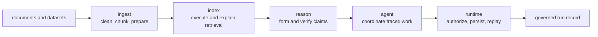

# bijux-canon

<!-- bijux-canon-badges:generated:start -->

<!-- bijux-canon-badges:generated:end -->

`bijux-canon` is a contract-first Python system for turning source material
into evidence-bearing, inspectable runs. Five canonical packages separate
preparation, retrieval, reasoning, orchestration, and runtime authority so a
reviewer can identify who made each decision and which artifact supports it.

The project is built for work that must survive review after execution. It
keeps API schemas in the repository, records provenance at retrieval and
reasoning boundaries, emits agent traces, and gives runtime policy the final
authority over persistence and replay. Determinism does not make a model
correct; it makes the execution conditions and resulting evidence inspectable.

## Trust Model

`bijux-canon` narrows claims to the evidence a run actually retains:

| Claim | Evidence required | What that evidence does not prove |
| --- | --- | --- |
| source preparation is repeatable | normalized records, chunk configuration, input identity, and typed failures | that the source itself is correct |
| retrieval is reproducible | execution request, backend capabilities, index identity, ranked results, and provenance | that the most relevant evidence exists in the corpus |
| a claim is supported | exact evidence spans, content digests, claim status, verification report, and reasoning trace | factual truth beyond the registered checks |
| agent work is auditable | ordered role calls, convergence decision, terminal status, and complete trace | that a provider behaved deterministically |
| a run is replayable | manifest, dataset and plan identities, policy, entropy record, finalized trace, and replay envelope | equivalence outside the declared replay boundary |

Missing evidence produces a narrower claim or an explicit refusal. It is not
reconstructed from a plausible final answer.

This repository publishes `11` packages. Each release tag builds one staged
bundle per package, uploads distributions to PyPI, publishes release bundles to
their exact GHCR package pages under the `bijux` account, and attaches the same
staged assets to the GitHub Release.

Current synchronized release line: `v0.3.9` dated `2026-07-04`.

The six compatibility distributions in this repository are real alias
packages, not migration-only placeholders. Five preserve retired public names,
and one preserves the shorter family-root `bijux-canon` runtime name. All six
re-export canonical package surfaces directly.

## One System, Five Authorities

| Authority | Accepts | Produces | Refuses to own |
| --- | --- | --- | --- |
| `bijux-canon-ingest` | source documents and preparation configuration | cleaned records, chunks, local indexes, retrieval-ready material | vector-backend execution policy |
| `bijux-canon-index` | declared vector operations, capabilities, and backend inputs | execution artifacts, provenance-rich results, explanations, replay comparisons | document normalization or claim meaning |
| `bijux-canon-reason` | problems, evidence, retrieval results, and verification rules | claims, checks, manifests, traces, and replayable reasoning runs | workflow choreography or whole-run authority |
| `bijux-canon-agent` | prompts, files, run configuration, and role-specific work | ordered pipeline outcomes and mandatory trace metadata | runtime acceptance and persistence policy |
| `bijux-canon-runtime` | flow manifests, datasets, policies, and lower-layer artifacts | accepted or rejected run records, stored artifacts, replay and diff results | reimplementing lower-package semantics |

The boundaries matter most when something fails. Preparation errors remain
ingest errors; unsupported backend capabilities remain index errors;
insufficient evidence remains a reasoning result; orchestration failures remain
traceable agent outcomes; policy violations remain runtime verdicts. No layer
has to disguise another layer's failure as success.

## Contract Surfaces

The public contract is larger than Python imports:

- Python distributions and typed root imports provide in-process use.
- Console commands provide automation-friendly entry points.
- Versioned OpenAPI documents under `apis/<package>/v1/` pin HTTP behavior for
  all five canonical packages.
- Package tests cover local semantics; API, invariant, integration, end-to-end,
  and regression suites protect the handoffs.
- Compatibility distributions preserve six existing names while canonical
  ownership remains with the five `bijux-canon-*` packages.

Start with the owning package instead of installing the entire family by
habit. The packages are independently publishable and intentionally do not
present one catch-all import surface.

## Read The Repository By Ownership

| If the question is about | Start here | Proof usually lives in |
| --- | --- | --- |
| cross-package rules, shared repository boundaries, or docs routing | [repository handbook](https://bijux.io/bijux-canon/) | `mkdocs.yml`, `pyproject.toml`, `Makefile`, `makes/`, `.github/workflows/` |
| product behavior in one canonical layer | the owning canonical package handbook in the `02` through `06` handbook sections | `packages/<package>/src`, `packages/<package>/tests`, `apis/` |
| maintainer automation, release posture, or repository health | [maintenance handbook](https://bijux.io/bijux-canon/07-bijux-canon-maintain/) | `packages/bijux-canon-dev`, `makes/`, `.github/workflows/` |
| older or shorter compatibility names | [compatibility handbook](https://bijux.io/bijux-canon/08-compat-packages/) | `packages/compat-*`, migration docs, package metadata |

## Repository Consolidation

The package family now ships from a single repository:

- canonical repository: [bijux-canon repository](https://github.com/bijux/bijux-canon)
- migration handbook: [Migration guidance](https://bijux.io/bijux-canon/08-compat-packages/migration/migration-guidance/)
- repository consolidation notes: [Repository consolidation notes](https://bijux.io/bijux-canon/08-compat-packages/migration/repository-consolidation/)

The following standalone repositories are being retired in favor of the
consolidated `bijux-canon` source of truth:

- `bijux/agentic-flows` -> `bijux-canon-runtime`
- `bijux/bijux-agent` -> `bijux-canon-agent`
- `bijux/bijux-rag` -> `bijux-canon-ingest`
- `bijux/bijux-rar` -> `bijux-canon-reason`
- `bijux/bijux-vex` -> `bijux-canon-index`

The repository also ships `bijux-canon` as a shorter compatibility
distribution for `bijux-canon-runtime`. It is a real alias package, not a
retired standalone repository.

## Engineering Commitments

- **Contracts are checked in.** The OpenAPI source, pinned representation, and
  schema hash for each canonical HTTP API are versioned under `apis/`.
- **Replay has preconditions.** A replay claim depends on declared contracts,
  captured inputs, stable identifiers, and the package's documented
  determinism boundary.
- **Failures retain ownership.** Packages expose typed failures and validation
  outcomes rather than silently coercing invalid work into plausible output.
- **Compatibility is observable.** Legacy distributions, imports, and commands
  are implemented as explicit alias packages with canonical targets.
- **Release evidence is shared.** PyPI distributions, GHCR bundles, and GitHub
  release assets are built from the same tagged source line.

## Package Map

The 11 publishable packages in this repository are:

| Package | Purpose | Links |
| --- | --- | --- |
| `bijux-canon-runtime` | Governed execution, policy enforcement, and replay |     |
| `bijux-canon` | Compatibility package for `bijux-canon-runtime` |     |
| `bijux-canon-agent` | Deterministic agent orchestration and execution surfaces |     |
| `bijux-canon-ingest` | Deterministic ingest, chunking, indexing, and retrieval preparation |     |
| `bijux-canon-reason` | Contract-driven reasoning runtime and run artifacts |     |
| `bijux-canon-index` | Contract-driven vector execution and audited retrieval |     |
| `agentic-flows` | Compatibility package for `bijux-canon-runtime` |     |
| `bijux-agent` | Compatibility package for `bijux-canon-agent` |     |
| `bijux-rag` | Compatibility package for `bijux-canon-ingest` |     |
| `bijux-rar` | Compatibility package for `bijux-canon-reason` |     |
| `bijux-vex` | Compatibility package for `bijux-canon-index` |     |

Repository-owned developer tooling also lives here in
[`packages/bijux-canon-dev`](packages/bijux-canon-dev), but it is for
maintaining the workspace rather than for end-user installation.

## Choose By The Decision You Need To Review

| Decision under review | Canonical package | First evidence to inspect |
| --- | --- | --- |
| how bytes became normalized records and chunks | `bijux-canon-ingest` | prepared records, configuration, and input identity |
| why a backend accepted, refused, or ranked a vector request | `bijux-canon-index` | `ExecutionRequest`, capabilities, and `ExecutionArtifact` provenance |
| how evidence became a claim | `bijux-canon-reason` | support references, content hashes, trace, and verification report |
| why a role ran and how the workflow terminated | `bijux-canon-agent` | `PipelineDefinition`, `PipelineResult`, and versioned `RunTrace` |
| whether the complete run may be retained or replayed | `bijux-canon-runtime` | `FlowManifest`, policy, finalized trace, and replay verdict |

The [published handbook](https://bijux.io/bijux-canon/) follows the same
ownership map. Use the [compatibility handbook](docs/08-compat-packages/index.md)
only for preserved distribution, import, submodule, or command names; current
behavior belongs to the canonical package.

## Verify A Claim

The repository keeps four proof surfaces separate:

- `packages/<package>/src` implements package behavior;
- `packages/<package>/tests` exercises local and cross-boundary invariants;
- `apis/<package>/v1` records the versioned HTTP schema, pinned representation,
  and hash; and
- run artifacts record what happened in one execution.

None substitutes for the others. A checked-in schema does not prove its server
is implemented, a passing unit test does not make a scientific claim true, and
a completed run does not establish replay without its identities and policy.

## Work With The Repository

- Read the [documentation map](docs/index.md) for package and evidence routing.
- Browse [packages](packages) for canonical and compatibility distributions.
- Browse [API contracts](apis) for checked-in HTTP schemas.
- Run `make help` for the supported local command surface.
- Run `make docs-check` for the strict documentation build.
- Read [CONTRIBUTING.md](CONTRIBUTING.md) before proposing a change.

## License

This repository is licensed under the Apache License 2.0. Copyright 2026 Bijan Mousavi <bijan@bijux.io>. See [`LICENSE`](LICENSE) and [`NOTICE`](NOTICE).
