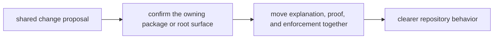

# Change Principles

Root-level change should leave `bijux-canon` easier to explain, not merely
more featureful.

The root exists to coordinate package truth. When a root change makes package
ownership harder to see, the repository gains short-term convenience at the
cost of long-term review accuracy.

## Change Model

This page should make root-level change feel disciplined rather than broad. A
good change clarifies one shared rule and leaves package ownership easier to
see than before.

## Tie-Break Order

When two plausible changes compete, prefer the option that:

- keeps behavior in the owning package instead of broadening the root
- moves explanation, schema, tests, and automation together when they describe
  the same shared rule
- makes the repository easier for a new reviewer to route correctly after one
  quick read
- keeps automation explicit about which package or shared rule it is protecting
- treats compatibility bridges as temporary migration pressure, not preferred
  design

## Reject This Shortcut

A root helper that quietly starts encoding ingest chunking rules or reason-level
claim policy is a regression even if it simplifies one local task. The helper
would hide product behavior behind repository glue and make later review less
honest.

## First Proof Checks

- `packages/` to confirm the behavior is not already owned by one package
- `Makefile`, `makes/`, and `.github/workflows/` to confirm a shared rule is
  actually enforced
- `apis/` when the change claims to protect more than one package contract
- neighboring package docs when the boundary feels arguable

## Design Pressure

The pressure on root change is always toward convenience. If a shared helper or
policy starts absorbing package-local behavior, the repository gains motion and
loses honesty at the same time.
