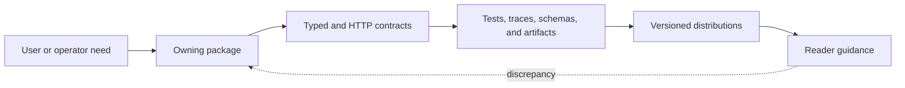
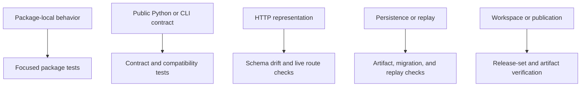

# Change Principles

Bijux Canon evolves as a family of independently owned packages joined by
explicit contracts. A change is complete when behavior, representation,
evidence, and release identity still describe the same system—not merely when
one implementation path passes.

```mermaid
flowchart LR
    need[User or operator need] --> owner[Owning package]
    owner --> contract[Typed and HTTP contracts]
    contract --> evidence[Tests, traces, schemas, and artifacts]
    evidence --> release[Versioned distributions]
    release --> docs[Reader guidance]
    docs -. discrepancy .-> owner
```

## Preserve One Owner per Decision

Each consequential decision has one canonical owner:

| Decision | Owner |
| --- | --- |
| source normalization and chunking | `bijux-canon-ingest` |
| retrieval execution and result provenance | `bijux-canon-index` |
| evidence-addressed claims and reasoning verification | `bijux-canon-reason` |
| role orchestration, convergence, and agent trace | `bijux-canon-agent` |
| run admission, policy, persistence, resume, and replay | `bijux-canon-runtime` |
| repository validation and publication guards | `bijux-canon-dev` |

The repository root coordinates these owners but does not reimplement their
behavior. A shared helper is appropriate only when it protects a genuinely
cross-package rule, such as schema pinning or release-set validation.

## Move Contracts and Evidence Together

A public change can cross several representations. Keep them synchronized in
the same release decision:

- Python models, imports, exceptions, and callable semantics;
- CLI commands, exit behavior, and machine-readable output;
- HTTP schemas and implemented routes;
- durable artifacts, fingerprints, and replay fields;
- focused tests and compatibility assertions;
- public explanation and migration guidance.

Changing only a schema does not change the implementation. Changing only the
implementation leaves callers without a stable contract. Changing only prose
creates a promise the repository cannot prove.

## Strengthen Evidence as Risk Increases

Use the narrowest evidence that proves the affected boundary, then add broader
checks when the change crosses packages or publication surfaces.

```mermaid
flowchart TD
    local[Package-local behavior] --> unit[Focused package tests]
    public[Public Python or CLI contract] --> contract[Contract and compatibility tests]
    http[HTTP representation] --> schema[Schema drift and live route checks]
    persisted[Persistence or replay] --> artifact[Artifact, migration, and replay checks]
    release[Workspace or publication] --> suite[Release-set and artifact verification]
```

An optimization must retain the evidence needed to explain it. Faster
retrieval without provenance, shorter reasoning without support links, or
smaller traces without replay identity changes the guarantee rather than its
cost.

## Compatibility Is an Edge Contract

The six compatibility distributions preserve existing package, import, and
command names while delegating to canonical owners. They must remain aliases,
not alternative implementation homes. New functionality enters through the
canonical package; compatibility surfaces inherit it through direct
dependency, re-export, and command forwarding.

Compatibility can be retired only through an explicit release policy with
consumer evidence and migration guidance. Silent removal and indefinite
divergence are both contract failures.

## Make Irreversible Boundaries Explicit

Some operations create durable authority:

- a runtime run is allocated and begins appending causal history;
- a trace is finalized and becomes immutable;
- an artifact or schema is content-addressed;
- a package version or container image is published;
- a compatibility name resolves to a released canonical dependency.

Changes around these boundaries need recovery and rollback semantics before
deployment. An external side effect cannot be undone by rolling back a DuckDB
record, and a published version cannot be replaced in place.

## Honest Limits

The package family does not claim that a healthy process proves a valid run,
that a readable artifact proves acceptance, or that replay proves scientific
truth. Health, integrity, verification, arbitration, and replay answer
different questions. Public guidance keeps those claims separate.

When an implementation surface is intentionally incomplete—such as a
contract-only HTTP route—the supported boundary remains visible instead of
being described as available.

## Review Invariants

Before accepting a change, confirm that:

- the decision still lives in its canonical owner;
- every changed public representation agrees;
- identifiers, hashes, ordering, and tenant authority remain stable where
  promised;
- failure, recovery, and replay behavior remain observable;
- compatibility aliases still resolve directly to canonical behavior;
- validation demonstrates the affected contract without bypassing a guard;
- the published explanation states both capability and limit.

The [Ownership Model](ownership-model.md) resolves boundary questions, the
[Package Map](package-map.md) lists public and support distributions, and
[Operations](../operations/index.md) connects these principles to validation
and release workflows.
