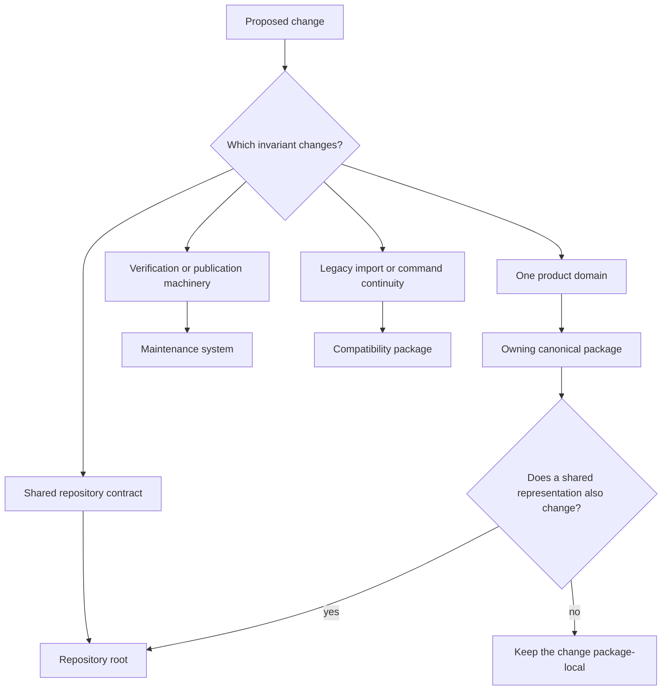

# Decision Rules

Route a change by the invariant it alters, not by the file or command where the
change was first observed. Canonical packages own product meaning; the root
owns composition and shared repository contracts; maintenance owns the tooling
that verifies those contracts; compatibility packages preserve older public
names by delegation.

## Product ownership

| Changed invariant | Owner | Durable evidence |
| --- | --- | --- |
| normalized documents, chunks, embeddings, or local cited retrieval | `bijux-canon-ingest` | prepared records, codecs, local index artifacts, ingest tests |
| vector execution, backend capability, ranking, approximation, or retrieval replay | `bijux-canon-index` | execution plans, artifacts, witnesses, run records, conformance tests |
| plans, evidence support, claims, reasoning traces, verification, or frozen replay | `bijux-canon-reason` | reasoning bundle, exact spans, reports, manifest, replay comparison |
| roles, lifecycle, provider calls, convergence, or orchestration trace | `bijux-canon-agent` | pipeline definition, ordered trace, terminal result, provider metadata |
| flow admission, modes, effects, arbitration, persistence, recovery, or workflow replay | `bijux-canon-runtime` | manifest, policy, events, DuckDB state, verdict, replay diff |

A shared test or root command does not transfer product ownership. For example,
an OpenAPI drift gate can detect an ingest response change, but ingest still
owns the response meaning.

## Repository-root ownership

The root owns facts that must be consistent across more than one distribution
or public surface:

- package inventory, canonical-to-compatibility mapping, and workspace
  dependency resolution;
- handbook navigation and the published documentation site;
- checked-in API source placement, pins, and hashes across packages;
- root command dispatch and common artifact routing;
- the repository-wide tag and release matrix; and
- shared compatibility and migration routes.

Root ownership coordinates package contracts; it must not introduce a new
interpretation of their data or failures.

## Maintenance ownership

Maintenance owns executable checks and publication machinery: reusable Make
contracts, `bijux-canon-dev` helpers, workflow job shape, security and quality
gates, build staging, SBOM generation, and documentation deployment. A
maintenance check can accept or refuse repository state under its rule. It
cannot redefine product behavior to make the check pass.

## Compatibility ownership

Compatibility packages own continuity for an established distribution,
import, or command name. They may adapt a call into the canonical surface and
preserve documented aliases. New domain behavior, artifact meaning, and policy
begin in the canonical package.

## Borderline decisions

Use the record that must change for behavior to become correct:

| Observation | Correct route |
| --- | --- |
| a root API check detects wrong chunk offsets | fix ingest, then refresh governed API representations if needed |
| two packages require the same schema-location rule | define the location at root and verify it through maintenance tooling |
| a release workflow publishes the wrong wheel | fix build or publication machinery unless the wheel metadata itself is wrong |
| an old command lacks a new canonical option | add canonical behavior first, then project it through the compatibility adapter |
| runtime receives an incomplete agent trace | fix agent trace production; runtime should refuse or mark it non-certifiable |

When two owners are involved, keep the responsibilities separate in code and
evidence. A cross-boundary change can require coordinated edits without
creating a shared catch-all implementation.

## Refuse the routing when

- ownership is justified only by where a convenient helper already lives;
- the root begins interpreting package-local data;
- maintenance code becomes a runtime dependency;
- a compatibility package gains independent domain semantics;
- a broad test is used instead of naming the changed invariant; or
- no retained artifact or executable check can demonstrate the chosen owner.

Correct routing makes failure ownership visible before implementation begins
and keeps each resulting contract independently reviewable.
