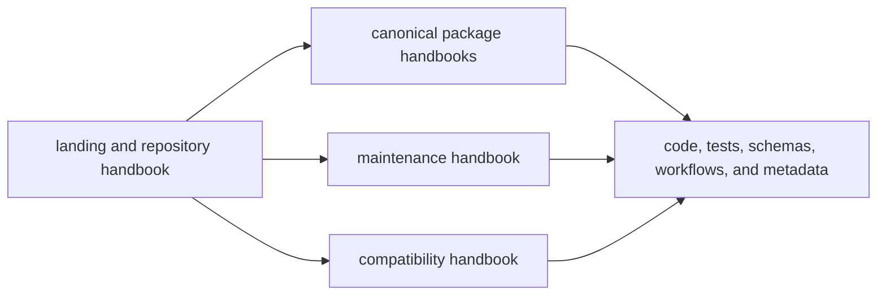

# Documentation System

The `bijux-canon` handbook exists to solve three reader problems quickly:
choosing the right owner, finding the proof behind a claim, and seeing where a
documentation page stops making claims.

The site is organized around one landing page, one repository handbook, one
five-branch handbook for each canonical product package, one maintenance
handbook, and one compatibility handbook. That structure is useful only if it
reduces routing mistakes and shortens the path from prose to checked-in proof.

## Documentation Model

This page should show the handbook as a routing system, not just a pile of
pages. Each branch exists to move readers toward the right owner and the right
proof surface quickly.

## What This System Prevents

- root pages that drift into package-local product explanation
- package pages that hide their ownership boundary behind generic prose
- maintainer pages that look like product docs
- compatibility pages that quietly feel canonical instead of transitional

## Current Proof Model

- `mkdocs.yml` defines the published structure readers actually navigate
- `docs/` carries the handbook entry surfaces and topic pages
- `packages/`, `apis/`, `Makefile`, `makes/`, and `.github/workflows/` supply
  the concrete proof behind most cross-page claims

## Fix The Weakest Surface First

Improve the page that most often sends readers to the wrong owner, not the page
that already reads well. In this repository that usually means fixing a blurred
boundary, a missing proof path, or a route block that sends readers in circles.

## Open This Page When

- the main question is where a topic belongs in the published handbook
- a page is starting to blur repository, package, maintenance, or compatibility ownership
- the docs structure itself is under review rather than one package behavior

## Design Pressure

If the docs system optimizes for page polish instead of routing accuracy, it
starts producing beautiful detours. The structure has to keep readers moving
toward the right owner and the right proof.
