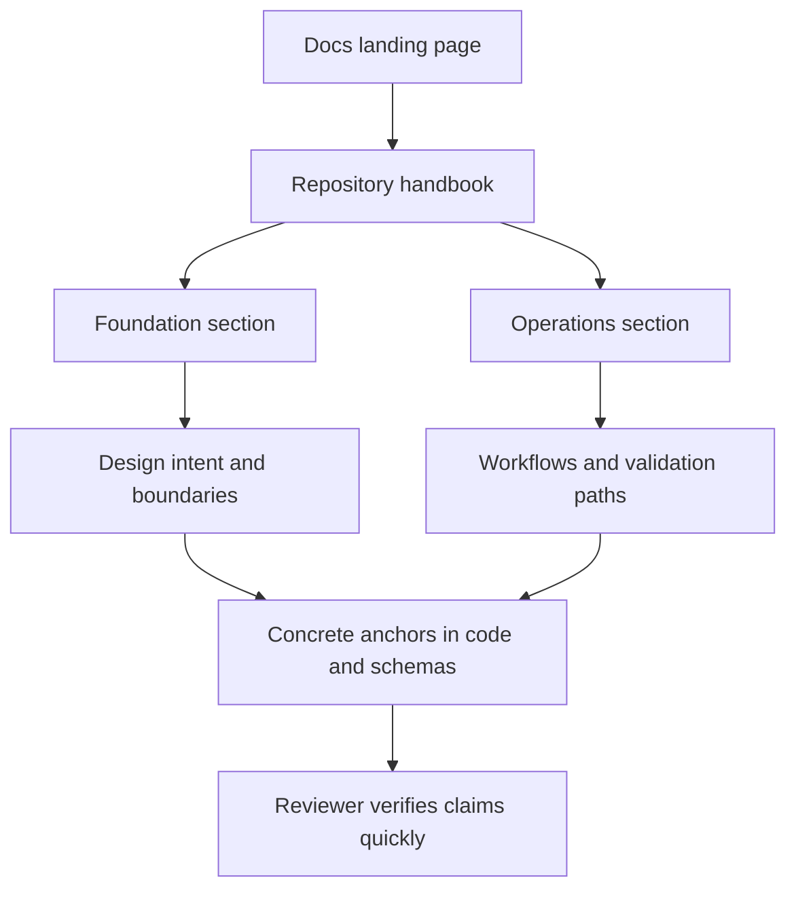

# Documentation System

The root documentation site is the canonical handbook for repository and
package behavior. It uses one landing page, section indexes, and stable topic
pages so readers can move from orientation into checked-in proof without
guesswork.

The goal is reader trust. The handbook should help a reviewer understand the
design quickly, help a maintainer find the concrete anchors behind a claim, and
stay explicit about what docs can explain versus what code, schemas, tests, and
release assets must still prove.

These repository pages explain the cross-package frame that no single package
can explain alone. They are strongest when they make the monorepo easier to
understand without turning the root into a second owner of package-local
behavior.

## Visual Summary

## Handbook Shape

- one landing page that explains the split and routes readers quickly
- one repository handbook for cross-package rules and shared assets
- one five-category handbook per canonical product package
- one maintainer handbook for repository-health automation
- one compatibility handbook for legacy names and migration pressure

## Documentation Rules

- use stable filenames that describe durable intent
- keep package handbooks on the same five-category spine
- separate product docs, maintainer docs, and legacy-compat docs
- update docs in the same change series that changes the underlying behavior

## Concrete Anchors

- `pyproject.toml` for workspace metadata and commit conventions
- `Makefile` and `makes/` for root automation
- `apis/` and `.github/workflows/` for schema and validation review

## Use This Page When

- you are dealing with repository-wide seams rather than one package alone
- you need shared workflow, schema, or governance context before changing code
- you want the monorepo view that sits above the package handbooks

## Decision Rule

Use `Documentation System` to decide whether the current question is genuinely repository-wide or whether it belongs back in one package handbook. If the answer depends mostly on one package's local behavior, this page should redirect instead of absorbing detail that the package should own.

## What This Page Answers

- which repository-level decision this page clarifies
- which shared assets or workflows a reviewer should inspect
- how the repository boundary differs from package-local ownership

## Reviewer Lens

- compare the page claims with the real root files, workflows, or schema assets
- check that repository guidance still stops where package ownership begins
- confirm that any repository rule described here is still enforceable in code or automation

## Honesty Boundary

These pages explain repository-level intent and shared rules, but they do not override package-local ownership. They also do not count as proof by themselves; the real backstops are the referenced files, workflows, schemas, and checks.

## Next Checks

- move to the owning package docs when the question stops being repository-wide
- check root files, schemas, or workflows named here before trusting prose alone
- use maintainer docs next if the root issue is really about automation or drift tooling

## Purpose

Use this page to understand how the handbook is organized, which section should
own a question, and where repository guidance should stop.

## Stability

Keep this page aligned with the actual docs tree and the layout rules enforced by this documentation catalog.
