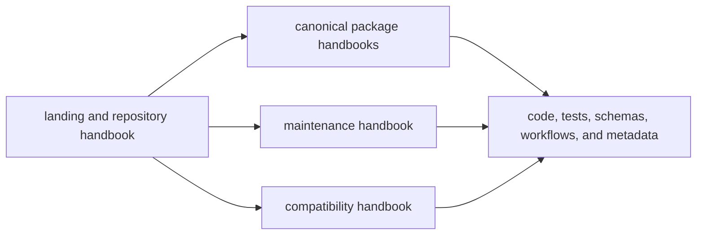

# Documentation System

The `bijux-canon` handbook exists to solve three reader problems quickly:
choosing the right owner, finding the proof behind a claim, and knowing when a
page has reached the edge of its authority.

The site is organized around one landing page, one repository handbook, one
five-branch handbook for each canonical product package, one maintenance
handbook, and one compatibility handbook. That structure is useful only if it
reduces routing mistakes and shortens the path from prose to checked-in proof.

## Documentation Model

```mermaid
flowchart LR
    landing["landing and repository handbook"]
    packages["canonical package handbooks"]
    maintain["maintenance handbook"]
    compat["compatibility handbook"]
    proof["code, tests, schemas, workflows, and metadata"]

    landing --> packages
    landing --> maintain
    landing --> compat
    packages --> proof
    maintain --> proof
    compat --> proof
```

Read the handbook as a routing system rather than a library shelf. Every branch
exists to answer one ownership question and then move the reader into code,
tests, schemas, workflows, or package metadata that can support the claim.

## Reader Routes

| If the question starts with | Open first | Expect proof in |
| --- | --- | --- |
| repository-wide rules, package seams, or shared governance | the repository handbook | `mkdocs.yml`, `Makefile`, `makes/`, `.github/workflows/`, `pyproject.toml` |
| canonical product behavior | the owning package handbook | `packages/<package>/src`, `packages/<package>/tests`, `apis/` |
| maintainer automation, release posture, or repository health | the maintenance handbook | `packages/bijux-canon-dev`, `makes/`, `.github/workflows/` |
| older or shorter public names | the compatibility handbook | `packages/compat-*`, migration docs, package metadata |

## What This System Prevents

- root pages that drift into package-local product explanation
- package pages that hide their ownership boundary behind generic prose
- maintainer pages that look like product docs
- compatibility pages that quietly feel canonical instead of transitional

## Current Proof Model

- `mkdocs.yml` defines the published structure readers actually navigate
- `docs/` carries the handbook entry surfaces and topic pages
- `packages/`, `apis/`, `Makefile`, `makes/`, and `.github/workflows/` supply
  the concrete proof behind most cross-page claims

## Page Contract

Every strong page in this site should do four things in order:

1. state what surface owns the topic
2. say what the surface does not own
3. point to the checked-in proof that can support the claim
4. route the reader away once another surface has stronger authority

## Fix The Weakest Surface First

Improve the page that most often sends readers to the wrong owner, not the page
that already reads well. In this repository that usually means fixing a blurred
boundary, a missing proof path, or a route block that sends readers in circles.

## Open This Page When

- the main question is where a topic belongs in the published handbook
- a page is starting to blur repository, package, maintenance, or compatibility ownership
- the docs structure itself is under review rather than one package behavior

## Design Pressure

If the docs system optimizes for page polish instead of routing accuracy, it
starts producing beautiful detours. The structure has to keep readers moving
toward the right owner and the right proof.
