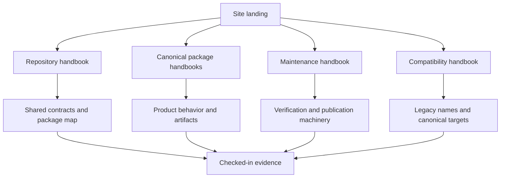

# Documentation System

The Bijux Canon site is organized by authority. It helps a reader identify the
component that made a decision, understand the retained evidence, and recognize
where a guarantee ends. The handbook complements source, schemas, tests, and
artifacts; it does not substitute for them.

```mermaid
flowchart TD
    H[Site landing] --> R[Repository handbook]
    H --> P[Canonical package handbooks]
    H --> M[Maintenance handbook]
    H --> C[Compatibility handbook]
    R --> S[Shared contracts and package map]
    P --> B[Product behavior and artifacts]
    M --> O[Verification and publication machinery]
    C --> L[Legacy names and canonical targets]
    S --> E[Checked-in evidence]
    B --> E
    O --> E
    L --> E
```

## Handbook map

| Section | Answers | Does not own |
| --- | --- | --- |
| [Repository handbook](../index.md) | system boundaries, package map, shared contracts, root operations | package-local algorithms or runtime semantics |
| [Ingest](../../02-bijux-canon-ingest/index.md) | source preparation, chunks, embeddings, local retrieval | governed vector execution or claim meaning |
| [Index](../../03-bijux-canon-index/index.md) | vector contracts, backends, ranking, approximation, replay | source transformation or evidence interpretation |
| [Reason](../../04-bijux-canon-reason/index.md) | evidence-to-claim records, verification, reasoning replay | role scheduling or whole-run authority |
| [Agent](../../05-bijux-canon-agent/index.md) | roles, lifecycle, providers, convergence, trace | claim truth or runtime admission |
| [Runtime](../../06-bijux-canon-runtime/index.md) | flow authority, effects, persistence, recovery, replay verdict | reimplementation of lower-package meaning |
| [Maintenance](../../07-bijux-canon-maintain/index.md) | Make contracts, helper modules, workflows, release and docs publication | end-user product behavior |
| [Compatibility](../../08-compat-packages/index.md) | older distributions, imports, commands, and migration | new canonical semantics |

## Evidence model

Different claims require different proof. Follow the nearest link from prose to
the owned representation:

| Claim in the handbook | Strongest checked-in evidence |
| --- | --- |
| Python interface exists | package metadata, public import, type contract, focused test |
| CLI behavior exists | registered entry point or module command, exit and output tests |
| HTTP operation exists | handler plus OpenAPI source, pin/hash agreement, live contract test |
| artifact is stable | schema or model, canonical serializer, round-trip and tamper tests |
| replay is supported | retained inputs, identity policy, frozen execution, structured comparison |
| release is publishable | tagged version, built distributions, publication guard, staged assets |
| compatibility is preserved | alias metadata, direct delegation, parity tests, migration route |

Schema presence alone does not prove implementation. A rendered example does
not prove executable behavior. A passing check proves only the rule it actually
evaluated.

## Page conventions

Public pages use the vocabulary of the reader-facing contract:

- diagrams show authority, data, or execution flow rather than editorial
  structure;
- examples use registered commands and real artifact paths;
- tables separate implemented behavior, external responsibility, and known
  limitation;
- failures remain visible rather than being converted into aspirational prose;
- links route to the owner when another section has stronger authority; and
- review dates identify when checked-in behavior was last reconciled with the
  explanation.

Maintainer procedures belong in the maintenance handbook. Product pages may
name a validation command when it helps users or contributors reproduce a
contract, but they do not carry repository policy or internal planning notes.

## Reading a guarantee

For any documented guarantee, ask four questions:

1. Which package or repository surface owns the decision?
2. Which input identity, policy, or configuration constrains it?
3. Which artifact or executable check records the result?
4. Which adjacent responsibility remains outside the guarantee?

If a page cannot answer those questions, treat its statement as orientation
rather than assurance and continue to the owning contract.

## Known limits of the site

The handbook is versioned with the repository branch being viewed. Published
package versions may have older behavior; use the matching tag, package
changelog, and distribution metadata for historical claims. External services,
provider models, and deployment policy can also change independently of the
repository. Their state must be captured by the application when a reproducible
claim depends on it.

The site earns trust by narrowing each statement to evidence that can be found,
executed, or inspected—not by presenting every component as complete or
equivalent.
