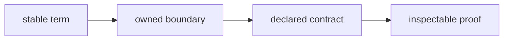
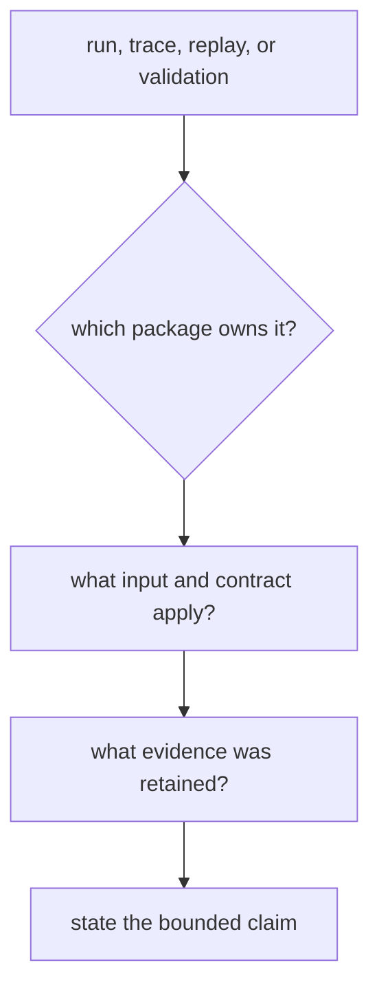

# Domain Language

Bijux Canon uses a small vocabulary to connect architectural claims to their
owners and proof. These terms distinguish product behavior from repository
coordination and distinguish a preserved public name from the implementation
that now owns it.

## Ownership Vocabulary

| Term | Meaning | Typical authoritative surface |
| --- | --- | --- |
| canonical package | A publishable `bijux-canon-*` distribution that owns product behavior | its public facade, package metadata, tests, and handbook |
| compatibility distribution | A separately published distribution that preserves an established package, import, or command name while delegating behavior to a canonical package | `packages/compat-*`, its generated facade, and parity tests |
| support package | Repository tooling that validates or releases the package family but is not part of the application stack | `packages/bijux-canon-dev` |
| repository root | The coordination boundary for workspace membership, shared contracts, documentation, CI, and releases | root metadata, `apis/`, `makes/`, workflows, and `docs/` |
| repository handbook | Cross-package architecture and operating guidance under `docs/01-bijux-canon/` | published MkDocs routes and documentation contracts |
| package handbook | Documentation for one package's public contract, behavior, and evidence | the package's numbered documentation section |
| maintainer handbook | Guidance for repository-health automation and enforcement | `docs/07-bijux-canon-maintain/` |

## Contract Vocabulary

| Term | Meaning | Important limit |
| --- | --- | --- |
| public facade | The supported in-process import boundary exported by a package | internal modules are not public merely because Python can import them |
| wire contract | A versioned request, response, error, and lifecycle shape visible across a process boundary | schema shape alone does not prove runtime semantics |
| capability | A named operation or backend behavior that can be resolved and validated | availability may depend on installed extras or registered plugins |
| policy | An explicit rule that can admit, refuse, constrain, or classify an operation | a policy decision is not an incidental exception path |
| provenance | Identity and lineage sufficient to connect an output to its inputs and execution context | provenance does not by itself establish scientific validity |
| artifact | A retained, addressable output from validation or execution | an artifact supports only the claim within its production boundary |
| proof surface | A file or behavior used to examine a claim: tests, schemas, metadata, workflow definitions, or run artifacts | no single proof surface establishes the entire platform |

## Execution Vocabulary

Several terms recur across packages but retain package-specific scope:

- **run** means an owned execution. An index run, agent run, and runtime run
  have different inputs, authority, and retained records.
- **trace** means ordered evidence about decisions inside one owning boundary.
  It is not automatically a distributed trace or a complete causal history.
- **replay** means re-evaluating or reconstructing retained execution evidence
  within a package's declared contract. It does not imply that external
  providers are called again or that all nondeterminism disappears.
- **validation** means checking a declared invariant. The invariant, owner, and
  input must accompany any validation claim.
- **refusal** is a typed, expected decision not to execute or accept an
  operation. It is distinct from an unhandled implementation failure.

## Names That Encode Authority

Use `repository root` for cross-package coordination rather than `root
package`. Use `platform` for the composed package family, not as a synonym for
one package. Reserve `canonical` for the distribution that owns behavior;
compatibility distributions preserve access but do not become parallel owners.

When describing a public surface, name its kind: Python facade, console
command, HTTP contract, artifact schema, or published handbook. This makes the
claim testable and prevents an internal helper from acquiring an accidental
compatibility promise.

## Apply The Vocabulary

“Runtime replay is deterministic” is too broad. “Given a retained runtime
record and the same supported policy inputs, runtime replay compares the
recorded and reconstructed result within runtime's replay contract” identifies
the owner, input, operation, and limit.

“The legacy package is still implemented” is also misleading. “The
`bijux-rag` compatibility distribution preserves its established import and
command names while delegating to `bijux-canon-ingest`” separates public-name
continuity from implementation ownership.

Use the [ownership model](ownership-model.md) to route decisions and the
[compatibility handbook](../../08-compat-packages/index.md) to inspect each
preserved surface.
