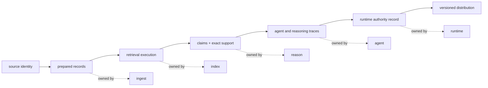
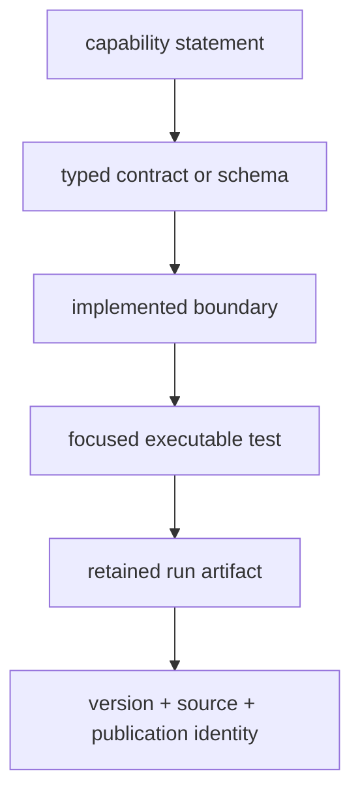

# Evidence Map

Bijux Canon separates a system claim from the records that make the claim
reviewable. Source preparation, retrieval, reasoning, orchestration, runtime
authority, release custody, and compatibility each produce different evidence.
No single status flag or generated answer represents the whole chain.

The solid path is an evidence chain, not a guarantee that the current package
roots execute as one live flow. Each package remains independently usable. A
cross-package claim requires an adapter record that preserves identities across
the relevant handoff.

## Find The Owning Evidence

| Question | Owning record | What the record establishes | What remains outside it |
| --- | --- | --- | --- |
| Which source bytes entered preparation? | source descriptor, digest, reader identity | input identity and admission path | source truth, license, or completeness |
| Which transformations produced a chunk? | preparation configuration, spans, observations, chunk digest | the declared normalization and segmentation path | semantic quality or original byte offsets unless retained |
| Why was a candidate returned? | index artifact, plan, backend capability, scores, provenance | eligibility and ranking under a named execution | whether the candidate supports a claim |
| Which bytes support a claim? | `EvidenceRef`, `SupportRef`, claim, verification findings | exact cited span, digest, inference kind, and check outcome | scientific truth beyond the retained evidence |
| Why did an agent workflow stop? | pipeline definition, ordered `RunTrace`, convergence and stop records | roles, transitions, calls, vetoes, and terminal reason | provider determinism or content correctness |
| Why was a run accepted or rejected? | manifest, authority, finalized execution trace, arbitration | the runtime decision under declared policy | universal correctness or transactional external effects |
| Which artifact was released? | source commit, version, built metadata, publication identity | release custody for that distribution | availability of every registry target or live composition |
| What does an older name execute? | exact dependency metadata, alias identity, command parity | delegation to the canonical owner | new behavior or missing canonical integrations |

## Evidence Strength

Evidence becomes stronger when it binds the decision, inputs, implementation,
and result rather than merely describing them:

This is not a universal ranking. A retained run artifact cannot replace a
schema when interoperability is the question, and a schema cannot establish
that a route is implemented. Select the evidence that directly answers the
decision under review.

## Detect Overstated Guarantees

Treat a claim as incomplete when any of these identities is missing:

- the package or subsystem that made the decision;
- the governed input, configuration, policy, model, or dataset version;
- the result artifact and its integrity identity;
- the check, arbitration, or acceptance rule applied to that result;
- the external state required to inspect or replay it; or
- the boundary beyond which the package makes no guarantee.

A digest proves identity, not correctness. A successful import proves
availability, not callable compatibility. A complete trace proves retained
history, not truth. A green release gate proves the rule it evaluated, not
that every package can execute as one live system.

## Continue At The Decision Owner

| Evidence needed | Continue with |
| --- | --- |
| source preparation, chunks, embeddings, and local retrieval | [Ingest](../../02-bijux-canon-ingest/index.md) |
| backend capability, ranking, approximation, and retrieval provenance | [Index](../../03-bijux-canon-index/index.md) |
| evidence support, claims, verification, and reasoning replay | [Reason](../../04-bijux-canon-reason/index.md) |
| roles, lifecycle, convergence, provider calls, and workflow trace | [Agent](../../05-bijux-canon-agent/index.md) |
| authority, execution modes, persistence, recovery, and replay verdict | [Runtime](../../06-bijux-canon-runtime/index.md) |
| local checks, workflow enforcement, build, and release custody | [Maintenance](../../07-bijux-canon-maintain/index.md) |
| preserved package names, import identity, command parity, and migration | [Compatibility](../../08-compat-packages/index.md) |

For historical behavior, use the matching tag, distribution metadata, and
package changelog. Provider services, mutable datasets, deployment policy, and
external artifact stores can change independently of this repository and must
be retained separately when a claim depends on them.
