# Foundation

The foundation section explains the design boundary that keeps package
ownership explicit: why the repository exists, where authority changes hands,
which terms stay stable, and which changes would weaken that clarity.

The main mistake this section should prevent is treating the root as a
convenient overflow area. These pages exist so a reviewer can tell, early and
plainly, whether a change belongs in shared governance or in one owning
package.

## Foundation Map

Foundation pages should make the repository's authority model visible before a
reader gets lost in package detail. The root explains why the split exists,
where the shared workspace boundary sits, and which decision rules protect the
package family from slow boundary drift.

```mermaid
flowchart LR
    intent["platform intent<br/>why split the system"]
    scope["repository scope<br/>what the root may own"]
    layout["workspace layout<br/>where ownership appears on disk"]
    packages["package map<br/>how authority moves"]
    language["domain language<br/>terms that keep reviews precise"]
    decisions["decision rules<br/>how changes stay narrow"]

    intent --> scope --> layout --> packages --> language --> decisions
    scope -. sends local behavior to .-> package["owning package handbook"]
    decisions -. rejects .-> blur["root creep and vague ownership"]

    classDef page fill:#eef6ff,stroke:#2563eb,color:#153145,stroke-width:2px;
    classDef positive fill:#eefbf3,stroke:#16a34a,color:#173622;
    classDef caution fill:#fff1f2,stroke:#dc2626,color:#6b1d1d;
    classDef anchor fill:#f4f0ff,stroke:#7c3aed,color:#47207f;
    classDef action fill:#fff4da,stroke:#d97706,color:#6b3410;
    class intent page;
    class scope,layout,packages,language,decisions positive;
    class package action;
    class blur caution;
```

## Start Here

- open [Platform Overview](https://bijux.io/bijux-canon/01-bijux-canon/foundation/platform-overview/) for the shortest statement of the repository design
- open [Repository Scope](https://bijux.io/bijux-canon/01-bijux-canon/foundation/repository-scope/) when you need to know what the root may document, enforce, or coordinate
- open [Ownership Model](https://bijux.io/bijux-canon/01-bijux-canon/foundation/ownership-model/) when you need the line between the root and a package
- open [Package Map](https://bijux.io/bijux-canon/01-bijux-canon/foundation/package-map/) when you want to read the split as owned responsibilities instead of directory names
- open [Decision Rules](https://bijux.io/bijux-canon/01-bijux-canon/foundation/decision-rules/) before making a cross-package change that might blur authority

## Pages In This Section

- [Platform Overview](https://bijux.io/bijux-canon/01-bijux-canon/foundation/platform-overview/)
- [Repository Scope](https://bijux.io/bijux-canon/01-bijux-canon/foundation/repository-scope/)
- [Workspace Layout](https://bijux.io/bijux-canon/01-bijux-canon/foundation/workspace-layout/)
- [Package Map](https://bijux.io/bijux-canon/01-bijux-canon/foundation/package-map/)
- [Ownership Model](https://bijux.io/bijux-canon/01-bijux-canon/foundation/ownership-model/)
- [Domain Language](https://bijux.io/bijux-canon/01-bijux-canon/foundation/domain-language/)
- [Documentation System](https://bijux.io/bijux-canon/01-bijux-canon/foundation/documentation-system/)
- [Change Principles](https://bijux.io/bijux-canon/01-bijux-canon/foundation/change-principles/)
- [Decision Rules](https://bijux.io/bijux-canon/01-bijux-canon/foundation/decision-rules/)

## Open This Section When

- you can see the repository shape but still need the design reason behind it
- you need to decide whether work belongs at the root or in a package
- you want the shortest route to the repository's enduring design logic

## Open Another Section When

- the real question is already about validation commands, release flow, or
  shared automation
- you need one package's interfaces, workflows, or tests instead of root logic
- you are already in maintainer-only workflow territory

## Concrete Anchors

- `packages/` for the first ownership check when root scope feels arguable
- `pyproject.toml` for the declared workspace boundary
- [Package Map](https://bijux.io/bijux-canon/01-bijux-canon/foundation/package-map/) and [Ownership Model](https://bijux.io/bijux-canon/01-bijux-canon/foundation/ownership-model/) for
  the clearest statement of authority changes
- [Decision Rules](https://bijux.io/bijux-canon/01-bijux-canon/foundation/decision-rules/) for the root-level test of whether a
  proposed change strengthens or blurs the split

## Read Across The Repository

- open [Operations](https://bijux.io/bijux-canon/01-bijux-canon/operations/) when you need to run, validate, release, or review shared work
- open the owning product handbook when a boundary question resolves into one package's local behavior
- open the [Maintainer Handbook](https://bijux.io/bijux-canon/07-bijux-canon-maintain/) when the issue is repository-health automation rather than repository intent

## Design Pressure

The split should remain easier to defend after a change than before it. If a
proposal simplifies one local task only by making ownership boundaries harder
to explain, the proposal is weakening the repository even if it reduces
short-term friction.

## Bottom Line

Open these pages when the question is why the root owns anything at all. Leave
them when the answer has narrowed to one package contract, one workflow, or one
proof surface.
