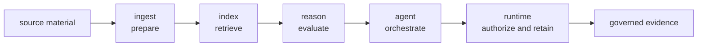

# Foundation

Bijux Canon is a family of independently useful Python packages joined by
explicit contracts. The repository coordinates those contracts, their public
documentation, and their release evidence; each product package retains
authority over its own behavior.

That separation is the foundation of the system. It lets a reader answer three
questions without treating the repository as one opaque application:

1. Which package owns this decision?
2. Which contract crosses the boundary?
3. Which artifact or check supports the resulting claim?

## Architecture At A Glance

```mermaid
flowchart LR
    source["source material"]
    ingest["ingest<br/>prepare"]
    index["index<br/>retrieve"]
    reason["reason<br/>evaluate"]
    agent["agent<br/>orchestrate"]
    runtime["runtime<br/>authorize and retain"]
    evidence["governed evidence"]

    source --> ingest --> index --> reason --> agent --> runtime --> evidence
```

The arrows describe common composition, not mandatory deployment. A service
may adopt one package, substitute an implementation behind a declared
capability, or compose the complete flow. The stable architecture is the
ownership boundary around each decision.

## Find The Right Foundation

| Question | Read | What it resolves |
| --- | --- | --- |
| What problem does the package family solve? | [Platform overview](platform-overview.md) | the source-to-evidence model and the limits of each package |
| What belongs at repository root? | [Repository scope](repository-scope.md) | coordination authority versus product behavior |
| Where are contracts, code, checks, and generated outputs? | [Workspace layout](workspace-layout.md) | the physical map of authoritative surfaces |
| Which package owns a capability or preserved name? | [Package map](package-map.md) | canonical, support, and compatibility distributions |
| Who decides when a concern crosses boundaries? | [Ownership model](ownership-model.md) | decision authority and escalation paths |
| What do shared architectural terms mean? | [Domain language](domain-language.md) | stable vocabulary for contracts, evidence, and compatibility |
| Which record supports a system claim? | [Evidence map](evidence-map.md) | decision ownership, evidence strength, and the boundary of each proof |
| What makes a cross-package change acceptable? | [Change principles](change-principles.md) | invariants for coherent changes |
| Where does an ambiguous change belong? | [Decision rules](decision-rules.md) | a repeatable routing test |

## Ownership Before Composition

```mermaid
flowchart TD
    question["behavior or contract question"]
    owner{"one product package owns the decision?"}
    package["use that package handbook"]
    shared{"shared membership, schema, docs, or release concern?"}
    root["use repository handbook"]
    maintenance["use maintainer handbook"]

    question --> owner
    owner -->|yes| package
    owner -->|no| shared
    shared -->|yes| root
    shared -->|automation health| maintenance
```

Package ownership comes before repository convenience. Normalization policy
belongs to ingest, retrieval execution to index, claim support to reason, role
coordination to agent, and run admission and retention to runtime. Root tooling
may invoke or verify those decisions, but it does not become their second
implementation home.

## Continue By Intent

- For product behavior, choose the owning package from the
  [package map](package-map.md), then follow its handbook.
- For repository commands, validation, releases, and contribution flow, use
  [Operations](../operations/index.md).
- For repository-health automation and enforcement internals, use the
  [Maintainer handbook](../../07-bijux-canon-maintain/index.md).
- For preserved distribution, import, and command names, use
  [Compatibility packages](../../08-compat-packages/index.md).
