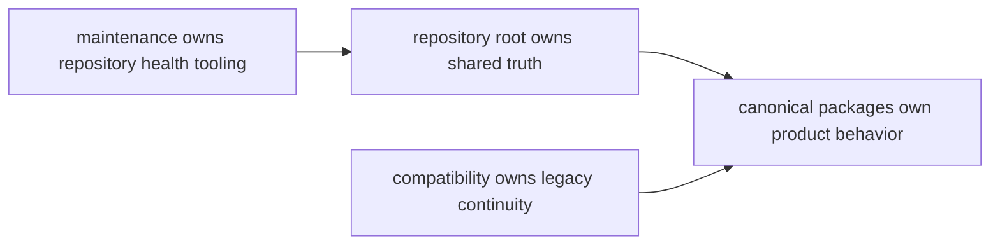

# Ownership Model

The repository is easiest to trust when ownership can be stated in layers
without hesitation.

The canonical packages own product behavior. The repository root owns only what
truly crosses package boundaries. The maintenance handbook owns repository
health tooling. Compatibility material owns legacy continuity while it still
points readers back toward the canonical package family.

## Layer Model

This page should let a reader name the repository layers without hesitation.
The model is working only when each layer explains a distinct kind of
responsibility rather than acting as overflow for the others.

- product behavior belongs in `packages/bijux-canon-*`
- shared governance belongs in the repository handbook and root automation
- maintainer automation belongs in `packages/bijux-canon-dev` and the
  maintenance handbook
- legacy continuity belongs in `packages/compat-*` and the compatibility
  handbook

## Conflict Case

If a release check needs to enforce one rule across ingest, index, and runtime,
the rule belongs at the root or in maintenance. If a helper script starts
encoding ingest-local retrieval preparation, that logic belongs back in
`bijux-canon-ingest` even if the script lives under root tooling today.

## What Would Change This Model

The model should change only when a responsibility is genuinely shared across
more than one package and can be proven from shared code, schemas, workflows,
or release assets. Convenience, history, or contributor familiarity are not
enough.

## Design Pressure

Ownership models decay when convenience beats clarity. If one layer starts
collecting work simply because it is nearby, every later review pays for that
shortcut.
