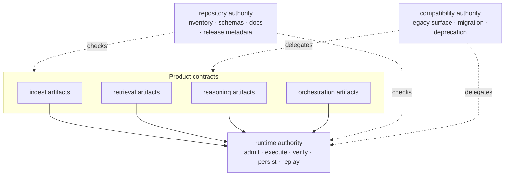

# Ownership Model

Authority in `bijux-canon` follows the artifact being decided. A package owns
the meaning and validity of its artifacts; the runtime owns whether a composed
run may proceed; repository tooling owns whether the published package family
remains internally consistent.

```mermaid
flowchart TB
    subgraph product["Product contracts"]
        ingest["ingest artifacts"]
        index["retrieval artifacts"]
        reason["reasoning artifacts"]
        agent["orchestration artifacts"]
    end

    runtime["runtime authority<br/>admit · execute · verify · persist · replay"]
    repository["repository authority<br/>inventory · schemas · docs · release metadata"]
    compat["compatibility authority<br/>legacy surface · migration · deprecation"]

    ingest --> runtime
    index --> runtime
    reason --> runtime
    agent --> runtime
    repository -. checks .-> product
    repository -. checks .-> runtime
    compat -. delegates .-> product
    compat -. delegates .-> runtime
```

## Decision rights

| Decision | Owner | Evidence of authority |
| --- | --- | --- |
| whether a document or chunk satisfies ingestion contracts | `bijux-canon-ingest` | domain types, processing results, ingest tests |
| whether a backend can execute a retrieval plan | `bijux-canon-index` | capability declarations, plan validation, execution trace |
| whether claims are grounded in recorded evidence | `bijux-canon-reason` | support references, byte spans, evidence hashes, verification report |
| whether orchestration reached a valid terminal state | `bijux-canon-agent` | lifecycle events, convergence decision, terminal trace |
| whether a composed execution is permitted and acceptable | `bijux-canon-runtime` | manifest, run mode, policy decisions, verification result |
| whether repository contracts are synchronized and publishable | `bijux-canon-dev` and root automation | inventory, schema, documentation, packaging, and release checks |
| how an older public name delegates and retires | the corresponding compatibility package | shims, warnings, migration documentation, compatibility tests |

## Handoff rules

Package boundaries do not erase provenance. A consumer should retain the
producer's stable identifiers, fingerprints, and trace data rather than
reconstructing their meaning later. This produces four practical rules:

1. **Validate at ingress.** Reject an invalid upstream artifact before adding
   downstream state.
2. **Preserve identity.** Keep content hashes, plan fingerprints, evidence
   references, and event identifiers through the handoff.
3. **Add decisions; do not rewrite history.** Runtime and orchestration layers
   append policy or lifecycle decisions instead of altering source evidence.
4. **Fail at the owning boundary.** Retrieval capability failures belong to
   index; unsupported evidence belongs to reason; execution-policy failures
   belong to runtime.

## Cross-package changes

A change is cross-package when it alters a shared schema, a runtime composition
contract, a compatibility promise, or repository publication metadata. The
behavior still begins in the package that owns the artifact. The repository
layer then verifies that consumers, frozen API material, documentation, and
release metadata agree.

Shared tooling must not become a second product implementation. For example,
an API drift checker may compare a generated schema with the checked-in
contract, but it must not decide how an ingest chunk is normalized. Likewise,
the runtime may reject an unverifiable reasoning artifact, but the reason
package remains the owner of grounding semantics.

## Compatibility ownership

Compatibility distributions may translate names, imports, arguments, or
result shapes required by their declared contract. They do not acquire
ownership of canonical behavior. Bug fixes belong in the canonical package
unless the defect exists only in the compatibility boundary.

This rule keeps migrations observable: users can see which surface is stable,
which owner implements it, and where a behavioral correction will land.
