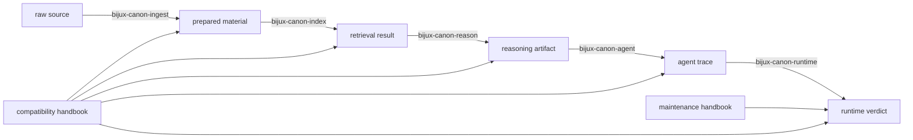

# Package Map

The package map is the clearest explanation of the product idea in this
repository. Each canonical package owns one part of a larger system, and the
handoff between them is the design.

This page should make the repository feel intentional. It is not a list of
folders. It is the contract that keeps preparation, retrieval, reasoning,
orchestration, and runtime authority from collapsing into one vague layer.

Read the package family as a pressure-tested handoff chain. Every package
narrows the meaning of the next step. Ingest makes input stable enough to use.
Index makes retrieval explainable. Reason makes evidence interpretable. Agent
makes workflow order inspectable. Runtime decides whether the whole run counts.
The maintainer and compatibility handbooks matter only because they protect or
route that chain without becoming substitute product owners.

## Responsibility Chain

| Package | Core role | What it hands forward |
| --- | --- | --- |
| `bijux-canon-ingest` | deterministic preparation of input material | normalized, retrieval-ready material |
| `bijux-canon-index` | retrieval execution and provenance-rich result handling | replayable evidence retrieval state |
| `bijux-canon-reason` | evidence-aware reasoning, claims, and verification | inspectable conclusions tied to evidence |
| `bijux-canon-agent` | role-based orchestration and trace-backed workflow control | coordinated multi-step work with explicit traces |
| `bijux-canon-runtime` | governed execution, replay, persistence, and final acceptability | accepted or replayable run outcomes |

## Why The Boundaries Matter

| Boundary | What improves when it stays explicit | What gets worse when it blurs |
| --- | --- | --- |
| ingest to index | retrieval can be reviewed against stable prepared input | retrieval bugs get misdiagnosed as document-cleaning problems |
| index to reason | claims can cite evidence without re-owning search | reasoning code starts compensating for hidden retrieval behavior |
| reason to agent | workflows can coordinate verified artifacts instead of raw impressions | orchestration becomes an unreviewable reasoning policy |
| agent to runtime | run acceptance can evaluate a complete trace | runtime becomes a miscellaneous bucket for workflow shortcuts |

## Common Misreads

- ingest is not the long-term owner of retrieval execution
- index is not the owner of reasoning semantics
- reason is not the owner of orchestration or final runtime authority
- agent is not the owner of package-local scientific truth
- runtime is not the place to absorb behavior merely because it sits last in the chain

## First Proof Checks

- `packages/` for the canonical boundaries themselves
- `apis/` for the checked-in contracts that expose package behavior
- package handbook roots for the owned promises behind each name
- `Makefile`, `makes/`, and `.github/workflows/` only when the question is
  about shared enforcement rather than package behavior

## Leave This Page When

- one package clearly owns the behavior under review
- the next step is a package-local contract, workflow, or test surface
- the question is really about shared enforcement rather than package ownership
