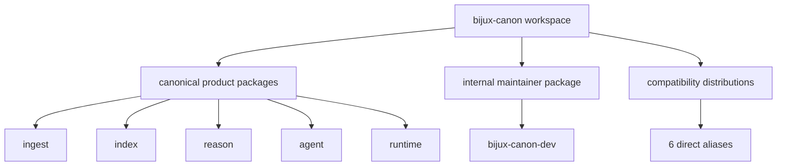
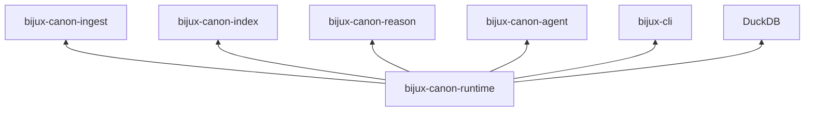

# Package Map

The repository contains five canonical product packages, one internal
maintainer package, and six published compatibility distributions. The package
name tells a caller which contract it is choosing; the directory location alone
does not establish whether a package is public, canonical, or released.

## Package Families

```mermaid
flowchart TD
    workspace["bijux-canon workspace"]
    product["canonical product packages"]
    support["internal maintainer package"]
    continuity["compatibility distributions"]

    workspace --> product
    workspace --> support
    workspace --> continuity

    product --> ingest["ingest"]
    product --> index["index"]
    product --> reason["reason"]
    product --> agent["agent"]
    product --> runtime["runtime"]
    support --> dev["bijux-canon-dev"]
    continuity --> aliases["6 direct aliases"]
```

The root `pyproject.toml` records these sets explicitly. Public release tooling
uses `public_release_packages`; repository checks include
`internal_support_packages`; compatibility inventory is not inferred from a
name prefix.

## Canonical Product Packages

| Distribution | Public Python package | Command | Owns | Characteristic evidence |
| --- | --- | --- | --- | --- |
| `bijux-canon-ingest` | `bijux_canon_ingest` | `bijux-canon-ingest` | normalization, chunking, deterministic preparation, ingest-local retrieval utilities | input identity, clean documents, chunks, processing results |
| `bijux-canon-index` | `bijux_canon_index` | `bijux-canon-index` | vector execution, backend capability checks, result provenance, execution comparison | `ExecutionRequest`, `ExecutionArtifact`, ranked result records |
| `bijux-canon-reason` | `bijux_canon_reason` | `bijux-canon-reason` | problem specifications, evidence-addressed claims, checks, reasoning replay | manifests, traces, claim graphs, verification reports |
| `bijux-canon-agent` | `bijux_canon_agent` | `bijux-canon-agent` | role orchestration, lifecycle transitions, convergence, trace recording | pipeline definition, ordered events, terminal `RunTrace` |
| `bijux-canon-runtime` | `bijux_canon_runtime` | `bijux-canon-runtime` | manifest admission, execution mode, policy, persistence, resume, whole-run replay | verdicts, run records, finalized traces, replay and diff results |

Index publishes its Typer application as `bijux-canon-index`. New integrations
may use that command or its typed Python and HTTP contracts. Existing
`bijux-vex` command automation remains available through the compatibility
distribution and delegates to the same application.

## Installed Dependency Topology

The package graph is intentionally asymmetric. Ingest, index, reason, and
agent are independently installable product boundaries; none declares another
canonical product package as a runtime dependency. Runtime composes all four.

```mermaid
flowchart BT
    ingest["bijux-canon-ingest"]
    index["bijux-canon-index"]
    reason["bijux-canon-reason"]
    agent["bijux-canon-agent"]
    runtime["bijux-canon-runtime"]
    cli["bijux-cli"]
    store["DuckDB"]

    runtime --> ingest
    runtime --> index
    runtime --> reason
    runtime --> agent
    runtime --> cli
    runtime --> store
```

This topology has concrete consequences:

- installing ingest, index, reason, or agent does not install the other three;
- installing runtime resolves the four canonical product dependencies within
  the compatible release range;
- importing a lower package must not require runtime to be installed;
- product-to-product handoffs use explicit records and adapters, not an
  undeclared dependency hidden behind local workspace availability; and
- the root development environment contains every package, so a successful
  repository import is not proof that a wheel declares the dependency it uses.

Use built-wheel metadata and an isolated installation when the dependency
boundary itself is under review.

## Repository Support

`bijux-canon-dev` is an internal support package. It owns repository inventory,
documentation configuration and badge checks, API drift and freeze checks,
dependency and security gates, SBOM requirement generation, version resolution,
and publication guards. It is part of workspace validation but is excluded from
the public release package list.

An application should never need `bijux-canon-dev` to execute product behavior.
If a product package depends on it at runtime, the ownership boundary has been
crossed in the wrong direction.

## Compatibility Distributions

| Preserved distribution | Canonical dependency | Preserved command |
| --- | --- | --- |
| `bijux-canon` | `bijux-canon-runtime` | `bijux-canon` |
| `agentic-flows` | `bijux-canon-runtime` | `agentic-flows` |
| `bijux-agent` | `bijux-canon-agent` | `bijux-agent` |
| `bijux-rag` | `bijux-canon-ingest` | `bijux-rag` |
| `bijux-rar` | `bijux-canon-reason` | `bijux-rar` |
| `bijux-vex` | `bijux-canon-index` | `bijux-vex` |

These packages are direct continuity bridges. They depend on their canonical
owner, re-export canonical modules, and exercise identity or command parity in
their tests. They do not contain an independent implementation. New code should
name the canonical distribution; existing code can migrate one import,
submodule, or command boundary at a time.

## Composition Rules

- Depend on the lowest package that owns the required decision.
- Pass typed artifacts across package boundaries instead of importing private
  implementation modules from a neighbor.
- Keep acceptance and persistence policy in runtime, even when a lower package
  provides the data being judged.
- Treat compatibility names as aliases at the edge, not as internal
  architecture.
- Use root metadata for package membership and release eligibility; use package
  code and tests for behavior.

The [ownership model](ownership-model.md) covers disputed boundaries. The
[compatibility catalog](../../08-compat-packages/catalog/index.md) records the
exact legacy-to-canonical mappings.
