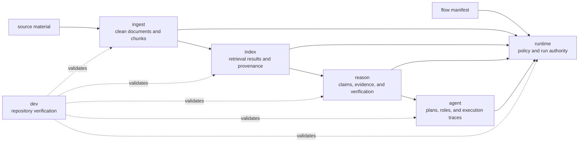

# Package Map

`bijux-canon` separates evidence preparation, retrieval, reasoning,
orchestration, and execution authority. The separation is deliberate: each
package produces an artifact that can be inspected before a more powerful
layer acts on it.

The repository contains six primary packages. Five provide product behavior;
`bijux-canon-dev` supplies repository-owned verification and release tooling.
Six compatibility distributions preserve established import and command names
while directing behavior to the canonical packages.

```mermaid
flowchart LR
    source["source material"] --> ingest["ingest<br/>clean documents and chunks"]
    ingest --> index["index<br/>retrieval results and provenance"]
    index --> reason["reason<br/>claims, evidence, and verification"]
    reason --> agent["agent<br/>plans, roles, and execution traces"]

    manifest["flow manifest"] --> runtime["runtime<br/>policy and run authority"]
    ingest --> runtime
    index --> runtime
    reason --> runtime
    agent --> runtime

    dev["dev<br/>repository verification"] -. validates .-> ingest
    dev -. validates .-> index
    dev -. validates .-> reason
    dev -. validates .-> agent
    dev -. validates .-> runtime
```

The left-to-right path describes the usual evidence flow, not a requirement to
use every package. Each canonical package remains useful at its own boundary.
The runtime composes the product packages and decides whether an execution is
permitted, persisted, replayable, and acceptable.

## Canonical packages

| Package | Owns | Principal artifacts | Does not own |
| --- | --- | --- | --- |
| `bijux-canon-ingest` | cleaning, chunking, embedding handoff, structural deduplication | clean documents, chunks, processing results | retrieval ranking or claim validity |
| `bijux-canon-index` | vector execution, backend capability checks, retrieval provenance | plans, retrieval results, run records | interpretation of retrieved evidence |
| `bijux-canon-reason` | evidence-addressed plans, claims, support spans, verification | problem specifications, traces, claim graphs, verification reports | multi-agent scheduling or runtime admission |
| `bijux-canon-agent` | role-based orchestration, lifecycle transitions, convergence, trace replay | agent inputs and outputs, plans, events, terminal traces | final authority over whether a run is allowed |
| `bijux-canon-runtime` | manifests, execution modes, policy arbitration, persistence, resume, replay | flow results, run records, verification decisions, finalized traces | silently repairing invalid package artifacts |
| `bijux-canon-dev` | package inventory checks, documentation contracts, API drift, release metadata | validation results and repository tooling | product runtime behavior |

## Compatibility distributions

Compatibility packages are migration surfaces, not parallel implementations.
Their names map to canonical owners in the repository package catalog:

| Distribution | Canonical owner |
| --- | --- |
| `bijux-canon` | `bijux-canon-runtime` |
| `agentic-flows` | `bijux-canon-runtime` |
| `bijux-agent` | `bijux-canon-agent` |
| `bijux-rag` | `bijux-canon-ingest` |
| `bijux-rar` | `bijux-canon-reason` |
| `bijux-vex` | `bijux-canon-index` |

Applications starting new integrations should import the canonical package
whose contract they need. Existing applications can use the compatibility
distribution while following its migration guide and deprecation policy.

## Choosing an entry point

- Start with **ingest** when raw material must become stable, addressable
  chunks.
- Start with **index** when the input is already prepared and retrieval plans,
  backend capabilities, or replay matter.
- Start with **reason** when evidence must support structured claims and a
  verification report.
- Start with **agent** when multiple roles or tools must follow an explicit,
  inspectable lifecycle.
- Start with **runtime** when one manifest must govern composition, execution
  mode, persistence, and acceptance.

The [ownership model](ownership-model.md) defines where cross-package decisions
belong. The [testing and validation guide](../operations/testing-and-validation.md)
maps public claims to executable evidence.
