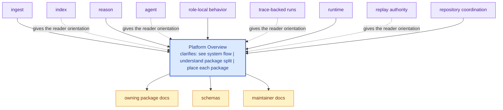

# Platform Overview

`bijux-canon` is a multi-package system because the work is easier to reason
about when preparation, retrieval, reasoning, orchestration, and runtime
governance stay distinct. The split is not cosmetic. It is the main mechanism
that keeps ownership explicit and review conversations short.

Read the platform as a pipeline of responsibilities rather than a stack of
directories. Ingest prepares deterministic material. Index turns retrieval
behavior into an executable contract. Reason shapes evidence-backed claims.
Agent coordinates role-local behavior and traceable runs. Runtime owns
execution, replay, and acceptance authority across the wider flow.

That design pays off in review. A reader can ask a sharper question sooner:
is this change about preparing material, executing retrieval, reasoning from
evidence, orchestrating work, or governing runtime outcomes? The repository
is healthier when that question has one obvious answer instead of five partial
ones.

These repository pages should explain the cross-package frame that no single package can explain alone. They are strongest when they make the monorepo easier to understand without turning the root into a second owner of package behavior.

## Visual Summary

## What the Repository Provides

- publishable Python distributions under `packages/`
- shared API schemas under `apis/`
- root automation through `Makefile`, `makes/`, and CI workflows
- one canonical documentation system under `docs/`

## What the Repository Does Not Try to Be

- a single import package with one root `src/` tree
- a place where repository glue silently overrides package ownership
- a documentation mirror that drifts away from the checked-in code

## Concrete Anchors

- `pyproject.toml` for workspace metadata and commit conventions
- `Makefile` and `makes/` for root automation
- `apis/` and `.github/workflows/` for schema and validation review

## Use This Page When

- you are dealing with repository-wide seams rather than one package alone
- you need shared workflow, schema, or governance context before changing code
- you want the monorepo view that sits above the package handbooks

## Decision Rule

Use `Platform Overview` to decide whether the current question is genuinely repository-wide or whether it belongs back in one package handbook. If the answer depends mostly on one package's local behavior, this page should redirect instead of absorbing detail that the package should own.

## What This Page Answers

- which repository-level decision this page clarifies
- which shared assets or workflows a reviewer should inspect
- how the repository boundary differs from package-local ownership

## Reviewer Lens

- compare the page claims with the real root files, workflows, or schema assets
- check that repository guidance still stops where package ownership begins
- confirm that any repository rule described here is still enforceable in code or automation

## Honesty Boundary

These pages explain repository-level intent and shared rules, but they do not override package-local ownership. They also do not count as proof by themselves; the real backstops are the referenced files, workflows, schemas, and checks.

## Next Checks

- move to the owning package docs when the question stops being repository-wide
- check root files, schemas, or workflows named here before trusting prose alone
- use maintainer docs next if the root issue is really about automation or drift tooling

## Purpose

This page gives the shortest description of what the repository is and why it is organized as a monorepo rather than a single distribution.

## Stability

Keep this page aligned with the real package set and the root-level automation that currently exists in the repository.
