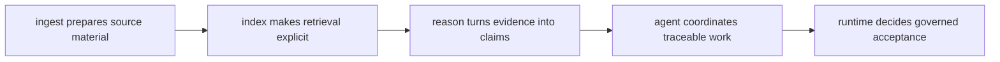

# Platform Overview

`bijux-canon` is a multi-package system because preparation, retrieval,
reasoning, orchestration, and runtime governance become easier to review when
they stay distinct.

## Platform Chain

The platform claim only holds if each package can be understood as one
defensible handoff in that chain. Readers should leave this page with the
sequence in mind before they open any local package section.

## One End-To-End Scenario

A source document is prepared into deterministic material by ingest. Index
turns that material into replayable retrieval behavior with provenance-rich
results. Reason converts the retrieved evidence into inspectable claims. Agent
coordinates the work that uses those claims. Runtime decides whether the run is
acceptable, replayable, and durable.

That sequence is why the repository behaves like a platform rather than a loose
set of packages. Each package hands a controlled artifact or responsibility to
the next one, and the root preserves the shared rules that keep those handoffs
legible.

## What Platform Drift Looks Like

- a root helper starts owning product behavior
- a package begins explaining more than one stage of the chain honestly
- a later package quietly redefines the contract of an earlier package instead
  of consuming it

## Concrete Anchors

- `packages/` for the canonical package boundaries
- `apis/` for shared schema sources and pinned artifacts
- `Makefile`, `makes/`, and `.github/workflows/` for shared enforcement
- `docs/` for the handbook structure that mirrors the split

## Design Pressure

If a package starts absorbing its neighbors' meaning, the platform stops being
a reviewable chain and becomes a pile of late-stage convenience. This page has
to keep the package split legible enough that readers can challenge drift.
