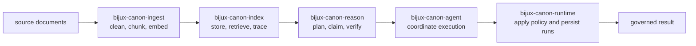
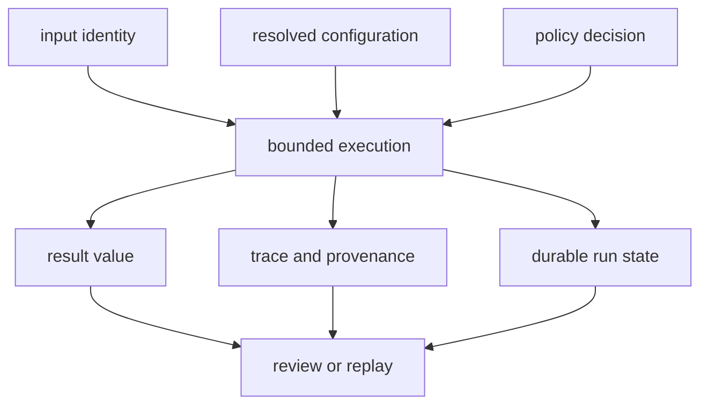

# Platform Overview

Bijux Canon is a family of Python packages for building evidence-bearing
knowledge workflows. It separates document preparation, retrieval, reasoning,
agent execution, and runtime governance so that every handoff can be inspected
without treating an entire application as one opaque operation.

The packages can be adopted independently. Together, they form a pipeline in
which source material becomes a governed result.

## The Package Chain

```mermaid
flowchart LR
    source["source documents"]
    ingest["bijux-canon-ingest<br/>clean, chunk, embed"]
    index["bijux-canon-index<br/>store, retrieve, trace"]
    reason["bijux-canon-reason<br/>plan, claim, verify"]
    agent["bijux-canon-agent<br/>coordinate execution"]
    runtime["bijux-canon-runtime<br/>apply policy and persist runs"]
    result["governed result"]

    source --> ingest --> index --> reason --> agent --> runtime --> result
```

This diagram describes responsibilities, not a mandatory deployment topology.
An application may use ingest with another retrieval engine, call reason
directly from a service, or use runtime without the agent package. The stable
boundary is the contract each package owns.

## What Each Boundary Owns

| Package | Owns | Produces or records |
| --- | --- | --- |
| `bijux-canon-ingest` | deterministic preparation of source material | cleaned documents, chunks, embeddings, and local indexes |
| `bijux-canon-index` | retrieval and execution provenance | query results, run metadata, status, and backend-specific state |
| `bijux-canon-reason` | evidence-linked reasoning | specifications, plans, traces, verification records, and fingerprints |
| `bijux-canon-agent` | orchestration of bounded agent work | final results and execution traces |
| `bijux-canon-runtime` | policy-aware flow execution | governed run records, decisions, traces, and replay state |

`bijux-canon-dev` supports repository tooling and documentation; it is not a
runtime dependency for applications. Compatibility distributions preserve
established import and command surfaces while delegating implementation to the
canonical packages.

## A Result Is More Than a Value

The platform is designed around a stronger output model than “the call
returned successfully.” A trustworthy run connects the returned value to the
inputs, configuration, decisions, and durable records that produced it.

```mermaid
flowchart TD
    input["input identity"] --> execution["bounded execution"]
    config["resolved configuration"] --> execution
    policy["policy decision"] --> execution
    execution --> value["result value"]
    execution --> evidence["trace and provenance"]
    execution --> state["durable run state"]
    value --> review["review or replay"]
    evidence --> review
    state --> review
```

The exact record varies by package. Ingest emphasizes content identity and
reproducible transformation. Index records retrieval execution. Reason writes
claim and verification evidence. Agent captures orchestration traces. Runtime
adds policy and run-mode decisions.

## Choosing an Entry Point

- Start with **Ingest** when raw files or records need deterministic cleaning,
  chunking, deduplication, or embedding.
- Start with **Index** when the main problem is storing and retrieving material
  across memory, SQLite, vector, or external backends.
- Start with **Reason** when evidence must be turned into inspectable claims or
  a replayable reasoning record.
- Start with **Agent** when multiple bounded operations need orchestration and a
  final traceable result.
- Start with **Runtime** when execution modes, policy decisions, persistence,
  observation, or replay are the primary concern.

For an end-to-end introduction, continue with the
[repository quickstart](../getting-started/quickstart.md). Package handbooks
then document the concrete API, CLI, storage, and compatibility contracts for
each boundary.

## Repository Map

| Path | Purpose |
| --- | --- |
| `packages/` | canonical and compatibility Python distributions |
| `apis/` | versioned schema sources and generated contract artifacts |
| `docs/` | public handbook, package guides, operations, and compatibility references |
| `configs/` | repository-owned tool configuration |
| `makes/` | root and package command composition |
| `artifacts/` | local builds, reports, run records, and other generated output |

The repository keeps these concerns separate for the same reason the platform
keeps its packages separate: ownership should be visible in both code and
evidence.
