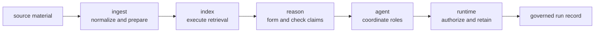
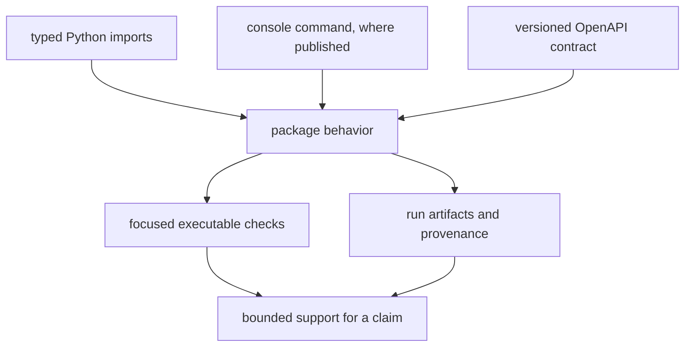

# Platform Overview

Bijux Canon is a contract-first Python package family for evidence-bearing
knowledge work. It separates source preparation, vector execution, reasoning,
orchestration, and whole-run authority so that a reviewer can locate the
decision, its inputs, and its retained evidence without treating an application
as one opaque operation.

The packages compose, but composition is optional. A service can prepare
documents without adopting runtime, use index behind its own API, or invoke
reason without agent orchestration. The durable architecture is the boundary
each package owns, not a required deployment diagram.

## From Source To Governed Record

```mermaid
flowchart LR
    source["source material"]
    ingest["ingest<br/>normalize and prepare"]
    index["index<br/>execute retrieval"]
    reason["reason<br/>form and check claims"]
    agent["agent<br/>coordinate roles"]
    runtime["runtime<br/>authorize and retain"]
    record["governed run record"]

    source --> ingest --> index --> reason --> agent --> runtime --> record
```

Each arrow is a review boundary. The receiving package should be able to
validate what it accepts, and the sending package should expose enough identity
and provenance for the handoff to be examined later.

| Boundary | Principal input | Principal retained evidence |
| --- | --- | --- |
| ingest | bytes, records, and preparation configuration | source identity, normalized documents, chunks, processing results, typed failures |
| index | prepared documents or vectors plus an execution request | capability resolution, identifiers, ranked results, execution artifact, provenance |
| reason | problem specification and addressable evidence | plan, claims, support references, trace, verification report |
| agent | pipeline definition, role inputs, and run configuration | ordered calls, lifecycle events, convergence decision, terminal trace |
| runtime | flow manifest, dataset, policy, and lower-layer outputs | admission verdict, finalized trace, persisted record, replay comparison |

## Authority Is Deliberately Narrow

The same word can mean different things at different boundaries. “Replay” in
index compares retrieval executions. Reason replay checks retained reasoning
invariants and provenance. Agent replay reconstructs a recorded summary; it
does not call providers again. Runtime replay evaluates the complete stored run
within runtime's declared boundary. Always pair a replay claim with the owning
package and the artifacts it retained.

Likewise, a successful result is not automatically an accepted run. Ingest can
successfully prepare material that later lacks useful evidence. Index can
return ranked results that do not support a claim. Agent can complete a
pipeline that runtime policy refuses to retain. These are visible boundary
outcomes, not contradictions.

## Select The Owning Package

| If you need to decide | Use | Do not delegate to it |
| --- | --- | --- |
| how source material becomes stable, addressable preparation output | `bijux-canon-ingest` | retrieval backend policy or claim validity |
| how a vector operation executes, refuses, ranks, or diverges | `bijux-canon-index` | document normalization or evidence interpretation |
| whether evidence references support structured claims | `bijux-canon-reason` | role scheduling or whole-run admission |
| which bounded role runs next and why orchestration stops | `bijux-canon-agent` | final persistence and acceptance policy |
| whether a composed run may execute, persist, resume, or replay | `bijux-canon-runtime` | rewriting lower-package semantics |

Index separates its state backend from its optional vector-store adapter. The
built-in execution state backends are memory, SQLite, and HNSW-backed state;
vector-store capability is resolved independently and may come from a
registered plugin. Remote adapters and the experimental pgvector path are not
part of the frozen v1 contract.

## Contract And Evidence Surfaces

```mermaid
flowchart TD
    imports["typed Python imports"] --> behavior["package behavior"]
    command["console command, where published"] --> behavior
    http["versioned OpenAPI contract"] --> behavior
    behavior --> tests["focused executable checks"]
    behavior --> artifacts["run artifacts and provenance"]
    tests --> claim["bounded support for a claim"]
    artifacts --> claim
```

No single surface proves the entire system. Python exports establish an
in-process contract. OpenAPI records HTTP shape. Tests exercise selected
semantics. Run artifacts show what happened in one execution. Strong claims
name the relevant surfaces and remain inside their combined boundary.

## Continue By Responsibility

- [Package map](package-map.md) lists canonical and compatibility ownership.
- [Ownership model](ownership-model.md) resolves cross-package decisions.
- [Testing and validation](../operations/testing-and-validation.md) maps
  repository claims to checks.
- [Compatibility packages](../../08-compat-packages/index.md) maps preserved
  names to canonical owners.
