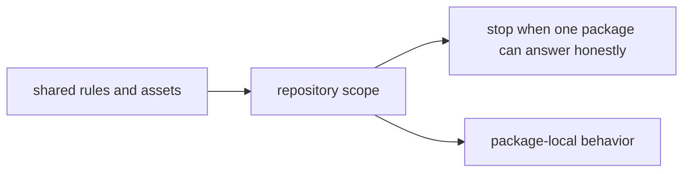

# Repository Scope

The repository root is intentionally narrow. It exists to coordinate packages
that must move together, not to become a second implementation layer above
them.

## Scope Map

This page should make the root feel bounded on purpose. The repository earns
its central position only by refusing to become a shadow product layer above
the packages.

## In Scope

- workspace-level build and test orchestration
- documentation, governance, and contributor-facing repository rules
- API schema storage and drift checks that involve multiple packages
- release tagging and versioning conventions shared across packages

## Out Of Scope

- package-local domain behavior that belongs inside a package handbook
- hidden root logic that bypasses package APIs
- undocumented exceptions to the published package boundaries

## Tempting But Wrong

A reusable script that seems helpful because it knows how reason forms claims or
how ingest assembles retrieval-ready output still belongs in the owning package.
The root may call into that package behavior, but it should not become the new
owner of it.

## Hard Stop Rule

If one package handbook can answer the question honestly, the root should stop
expanding and send the reader there.

## First Proof Checks

- `packages/` when ownership is in doubt
- `apis/` when the concern is shared schema truth
- `Makefile`, `makes/`, and `.github/workflows/` when the concern is shared
  workflow or validation enforcement

## Design Pressure

The root is always tempting because it is visible to everyone. If that
visibility starts deciding ownership, the scope has already slipped.
