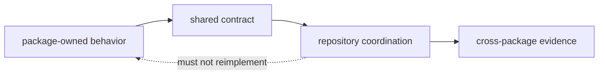
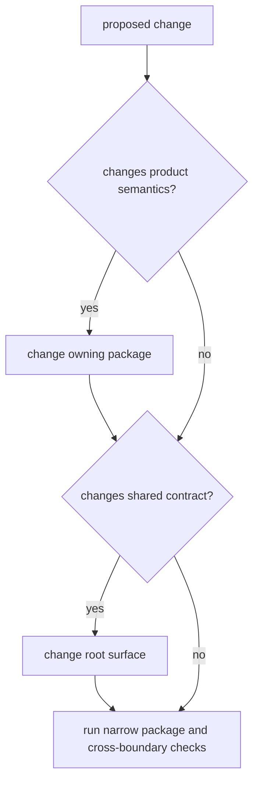

# Repository Scope

The repository root coordinates contracts that must agree across packages. It
does not provide a second implementation layer above them. Product semantics
remain in the package that owns the decision; root surfaces make membership,
validation, documentation, and publication consistent.

## Ownership Boundary

```mermaid
flowchart LR
    package["package-owned behavior"]
    contract["shared contract"]
    root["repository coordination"]
    evidence["cross-package evidence"]

    package --> contract --> root --> evidence
    root -. "must not reimplement" .-> package
```

| Concern | Owner | Root responsibility |
| --- | --- | --- |
| normalization, retrieval, reasoning, orchestration, runtime policy | canonical product package | dispatch the package's focused checks and publish its handbook route |
| Python dependency resolution and package membership | root workspace | declare exact workspace, primary, compatibility, support, and release sets |
| HTTP behavior | canonical product package | retain versioned schema source, pin, and hash; run drift and contract checks |
| local validation composition | root Make surfaces | expose stable entrypoints and delegate package-specific work |
| CI and release events | GitHub workflows | define triggers, permissions, job dependencies, and publication gates |
| public information architecture | `mkdocs.yml` and `docs/` | route readers to the owning handbook and enforce publication contracts |
| compatibility behavior | compatibility distribution | inventory mappings and verify delegation to the canonical package |

## Root-Owned Surfaces

- `pyproject.toml` and `uv.lock` define the Python workspace and resolved
  dependency graph.
- `apis/` retains six versioned HTTP contract trees across five packages;
  Runtime v2 is the primary whole-product contract.
- `Makefile` and `makes/` compose supported local operations.
- `.github/workflows/` coordinates verification, policy, documentation, and
  releases.
- `mkdocs.yml`, `mkdocs.shared.yml`, and `docs/` define the published handbook.
- `packages/bijux-canon-dev` implements repository-specific checks and release
  guards without becoming an application dependency.
- `artifacts/` contains local generated outputs rather than source contracts.

## Decisions That Stay Package-Local

The root must not decide how ingest chunks a document, which index capability
an execution requires, whether reason marks support insufficient, why agent
converges, or whether runtime admits a flow. Root automation may invoke and
verify those decisions, but it must not duplicate their implementations.

A shared helper is not automatically root-owned. If it understands one
package's domain types or changes one package's output semantics, it belongs in
that package even when several root commands call it.

## Locate The Evidence

| Question | Inspect first | Then confirm with |
| --- | --- | --- |
| Is a package part of a public release? | `[tool.bijux_canon].public_release_packages` | publication guard and release workflow |
| Is an HTTP shape governed? | `apis/<package>/<version>/` | owning implementation and live contract test; Runtime v2 additionally requires transport parity |
| What does a root command execute? | `Makefile` and included file under `makes/` | invoked package command and generated artifact |
| Why did a workflow run? | workflow trigger and job dependency graph | event payload and job logs |
| Where does a product decision belong? | owning package public facade | package handbook and focused tests |
| What does a preserved name execute? | compatibility package metadata | module identity and command parity tests |

## Change Routing

```mermaid
flowchart TD
    change["proposed change"]
    domain{"changes product semantics?"}
    package["change owning package"]
    shared{"changes shared contract?"}
    root["change root surface"]
    verify["run narrow package and cross-boundary checks"]

    change --> domain
    domain -->|yes| package --> shared
    domain -->|no| shared
    shared -->|yes| root --> verify
    shared -->|no| verify
```

A public HTTP change commonly touches both owners: the package changes behavior
and tests, while the root-governed API tree changes its schema, pin, and hash.
A package-internal algorithm change may never need a root edit. A release-set
change is root-owned even if no product behavior changes.

Continue with the [workspace layout](workspace-layout.md) for physical paths or
the [decision rules](decision-rules.md) for cross-package placement choices.
