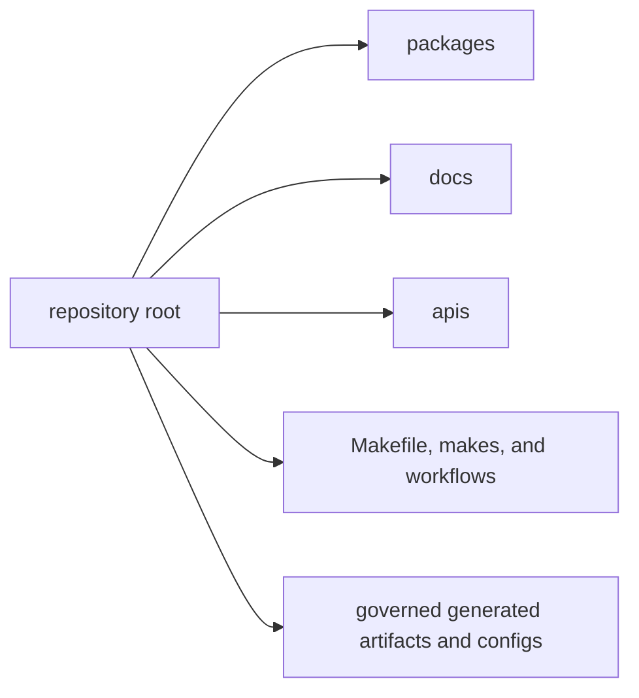

# Workspace Layout

The repository layout is part of the design language. A good top-level layout
makes it obvious where a concern belongs before a reader opens implementation
detail.

## Layout Map

This page should help a reader place a concern before reading code. The layout
works when the tree itself reinforces the package split and the shared
surfaces, instead of forcing readers to guess.

## Top-Level Areas

- `packages/` for publishable Python distributions and their owned behavior
- `apis/` for shared schema sources and pinned artifacts
- `docs/` for the canonical handbook that routes readers into owners
- `makes/` and `Makefile` for shared automation and command routing
- `.github/workflows/` for verification and release execution
- `artifacts/` for generated or checked validation output
- `configs/` for root-managed tool configuration

## Governed Versus Local

Treat `apis/`, `docs/`, `Makefile`, `makes/`, and `.github/workflows/` as
shared root surfaces. Treat `packages/` as the place where product behavior and
package-local contracts should stay visible.

## Skepticism Signals

Be cautious when a change:

- introduces product logic under root automation instead of in a package
- writes proof output into an ad hoc location rather than a governed surface
- adds a top-level directory without making the ownership reason obvious

## First Proof Checks

- `packages/` to confirm package-local ownership
- `Makefile`, `makes/`, and `.github/workflows/` for shared automation claims
- `apis/` and `docs/` for shared schema or documentation structure claims

## Design Pressure

Top-level trees drift when convenience directories appear faster than ownership
rules. If a new path makes placement harder instead of easier, the layout is
already teaching the wrong lesson.
