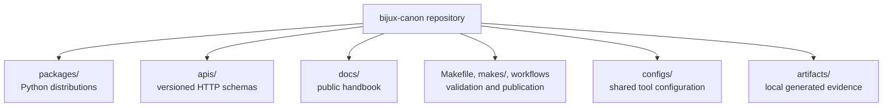
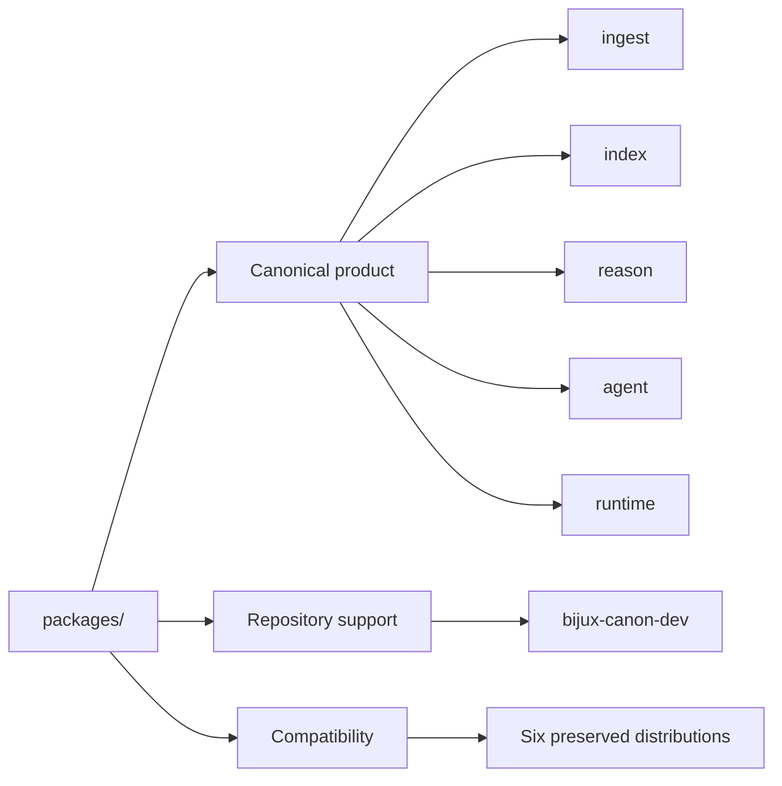
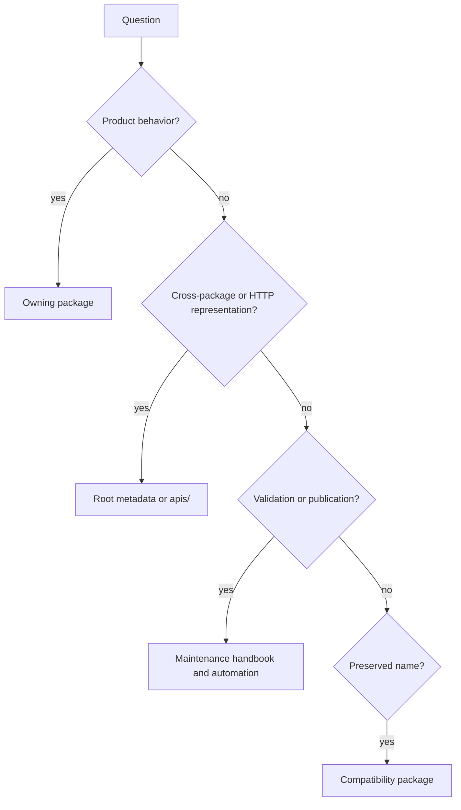

# Workspace Layout

The repository tree separates product behavior, public contracts, reader
guidance, validation machinery, and generated evidence. That separation tells
readers which source can answer a question and prevents root automation from
becoming a hidden product layer.

```mermaid
flowchart TD
    root[bijux-canon repository]
    packages[packages/\nPython distributions]
    apis[apis/\nversioned HTTP schemas]
    docs[docs/\npublic handbook]
    automation[Makefile, makes/, workflows\nvalidation and publication]
    configs[configs/\nshared tool configuration]
    artifacts[artifacts/\nlocal generated evidence]

    root --> packages
    root --> apis
    root --> docs
    root --> automation
    root --> configs
    root --> artifacts
```

## Top-Level Authority

| Path | Owns | Does not own |
| --- | --- | --- |
| `packages/` | publishable distributions and internal repository tooling | workspace-wide policy by directory presence alone |
| `apis/` | source and pinned OpenAPI representations for package HTTP contracts | route implementation or runtime availability |
| `docs/` | the public information architecture and supported operating guidance | executable conformance |
| `Makefile` and `makes/` | repeatable command composition and package dispatch | package domain semantics |
| `.github/workflows/` | CI, documentation deployment, and release orchestration | local proof unless the workflow runs |
| `configs/` | root-managed configuration for repository tools | application runtime configuration |
| `artifacts/` | generated local builds, reports, caches, and run evidence | checked-in source authority |

Root `pyproject.toml` and `uv.lock` define workspace membership and dependency
resolution. They can show that a distribution participates in a release, but
the distribution’s package code and tests define its behavior.

## Package Tree

The `packages/` directory contains three distinct families:

```mermaid
flowchart LR
    packages[packages/]
    canonical[Canonical product]
    support[Repository support]
    compat[Compatibility]

    packages --> canonical
    packages --> support
    packages --> compat
    canonical --> ingest[ingest]
    canonical --> index[index]
    canonical --> reason[reason]
    canonical --> agent[agent]
    canonical --> runtime[runtime]
    support --> dev[bijux-canon-dev]
    compat --> aliases[Six preserved distributions]
```

Canonical product packages own user-visible behavior. `bijux-canon-dev` owns
repository-health and publication checks and is not a runtime dependency for
applications. Compatibility packages preserve older names by forwarding to a
canonical owner; they do not own a second implementation.

## HTTP Contract Tree

Each governed HTTP surface under `apis/` keeps the source schema with the
repository’s pinned representation and digest. The owning product package
contains route code and contract tests. These layers answer different
questions:

| Layer | Question answered |
| --- | --- |
| source schema | what request and response representation is declared? |
| pin and digest | did the governed representation drift? |
| route implementation | is the operation implemented? |
| live contract test | does the implementation conform under execution? |
| package handbook | how should a caller use it, and what remains unavailable? |

An endpoint can be schema-valid yet intentionally return `501`; schema
presence must not be mistaken for operational support.

## Documentation Tree

The published site is organized by authority:

- `01-bijux-canon` explains repository-wide composition and governance;
- `02` through `06` explain the five canonical product packages;
- `07-bijux-canon-maintain` explains repository-health and automation
  internals;
- `08-compat-packages` explains preserved distributions and migration.

Numbered directories control site order; their enduring names identify the
owned subject. Product semantics remain in the owning package section even
when a root workflow validates them.

## Generated and Governed Output

Local builds and checks write beneath `artifacts/`. Documentation builds,
test caches, reports, and execution examples can then be inspected or removed
without confusing them with source. Generated output belongs elsewhere only
when the repository explicitly governs that destination, such as a pinned API
schema or published documentation source.

Do not infer release readiness from the presence of an artifact directory.
Publication workflows rebuild, validate, sign, and attest the selected source
under their own authority.

## Finding the Right Source

```mermaid
flowchart TD
    question[Question]
    behavior{Product behavior?}
    package[Owning package]
    representation{Cross-package or HTTP representation?}
    root[Root metadata or apis/]
    operation{Validation or publication?}
    maintain[Maintenance handbook and automation]
    oldname{Preserved name?}
    compat[Compatibility package]

    question --> behavior
    behavior -- yes --> package
    behavior -- no --> representation
    representation -- yes --> root
    representation -- no --> operation
    operation -- yes --> maintain
    operation -- no --> oldname
    oldname -- yes --> compat
```

The [Package Map](package-map.md) lists exact distributions and commands. The
[Documentation System](documentation-system.md) explains site navigation, and
the [Repository Handbook](../index.md) maps cross-package questions to their
strongest evidence.
