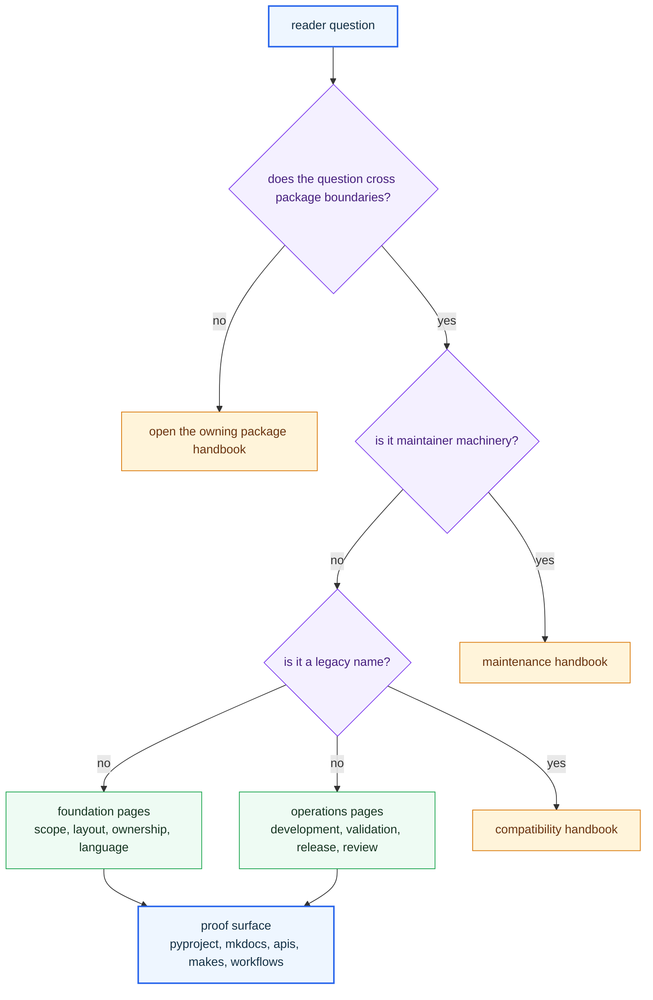

# Repository Handbook

Open the repository handbook when the question belongs to the part of
`bijux-canon` that no single package owns alone: why the split exists, which
rules belong at the root, and how package handoffs stay explicit across the
repository.

The main repository mistake this handbook is meant to prevent is root creep.
The root should coordinate package truth, not become a second product layer
that quietly re-explains or overrides package ownership.

<strong>The root is a coordination layer, not a shadow owner.</strong>
Product behavior belongs in the publishable packages under `packages/`. The
root owns only what is genuinely shared: workspace layout, schema governance,
documentation rules, validation posture, and release coordination.

## Reader Contract

This handbook should answer three questions before a reviewer touches code:

- is the concern genuinely repository-wide, or does one package own it
- which shared file, schema, workflow, or rule backs the claim
- where should the reader go next when the root no longer has authority

## Start Here

- open [Foundation](https://bijux.io/bijux-canon/01-bijux-canon/foundation/) for repository shape, split logic, ownership boundaries, and shared terminology
- open [Operations](https://bijux.io/bijux-canon/01-bijux-canon/operations/) for contributor workflow, validation posture, release flow, and review rules
- open the [Maintenance Handbook](https://bijux.io/bijux-canon/07-bijux-canon-maintain/) when the concern is helper code, Make routing, workflow fan-out, or repository-health automation
- open the [Compatibility Handbook](https://bijux.io/bijux-canon/08-compat-packages/) only when a legacy package name or migration question is still active
- leave this handbook as soon as the behavior is clearly local to one canonical package

## What This Handbook Owns

- why the repository is split into canonical packages instead of one combined surface
- root-owned workflow, validation, release, artifact, and documentation rules
- the seams where one package hands authority to another package or to a shared root rule

## What This Handbook Does Not Own

- ingest, index, reason, agent, or runtime behavior inside the product handbooks
- helper implementation detail that belongs in the maintainer handbook
- legacy-name migration policy that belongs in the compatibility handbook

## Shared Package Map

| Canonical package | Repository-level promise | Root-level proof to inspect |
| --- | --- | --- |
| `bijux-canon-ingest` | source material becomes deterministic preparation output before downstream use | package entry in `pyproject.toml`, handbook route in `mkdocs.yml`, package code under `packages/bijux-canon-ingest` |
| `bijux-canon-index` | retrieval executes through auditable contracts rather than hidden search behavior | API schema under `apis/bijux-canon-index`, package tests, handbook route |
| `bijux-canon-reason` | retrieved evidence becomes claims, checks, and reasoning artifacts | API schema under `apis/bijux-canon-reason`, package tests, handbook route |
| `bijux-canon-agent` | role-based orchestration emits traces instead of swallowing decisions | API schema under `apis/bijux-canon-agent`, package tests, handbook route |
| `bijux-canon-runtime` | the full run is accepted, rejected, persisted, or replayed under explicit policy | API schema under `apis/bijux-canon-runtime`, runtime regression tests, handbook route |

## Boundary Example

A schema pin under `apis/`, a workspace-level validation rule, or a handbook
routing rule belongs here because it protects more than one package at once. A
change to ingest chunking, runtime replay semantics, or reason-level claim
formation does not belong here, even if the root automation or docs also have
to move with it.

## First Proof Checks

- check `pyproject.toml` when the claim is about workspace structure or commit rules
- check `Makefile`, `makes/`, and `.github/workflows/` when the claim is about shared automation or validation
- check `apis/` when the claim is about shared schema storage or compatibility review
- check `packages/` when the question is whether the root is starting to blur a package boundary

## Open This Handbook When

- you are dealing with repository-wide seams rather than one package alone
- you need shared workflow, schema, or governance context before changing code
- you want the monorepo view that sits above the package handbooks

## Open Another Handbook When

- the answer depends mostly on one package's local behavior, imports, tests, or interfaces
- you need workflow automation internals rather than root-facing guidance
- the work is explicitly about a legacy name and migration path

## Cross-Package Anchors

- `pyproject.toml` declares the workspace and package set
- `mkdocs.yml` defines the published handbook structure
- `Makefile`, `makes/`, and `.github/workflows/` carry root-level operations
- `packages/` carries the canonical product boundaries the root must not blur

## Bottom Line

Use these pages to understand why the split exists, which rules stay shared,
and where authority changes hands. Once the behavior is package-local, open
the owning package handbook instead of keeping the explanation at the root.
