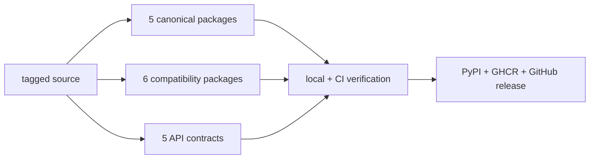
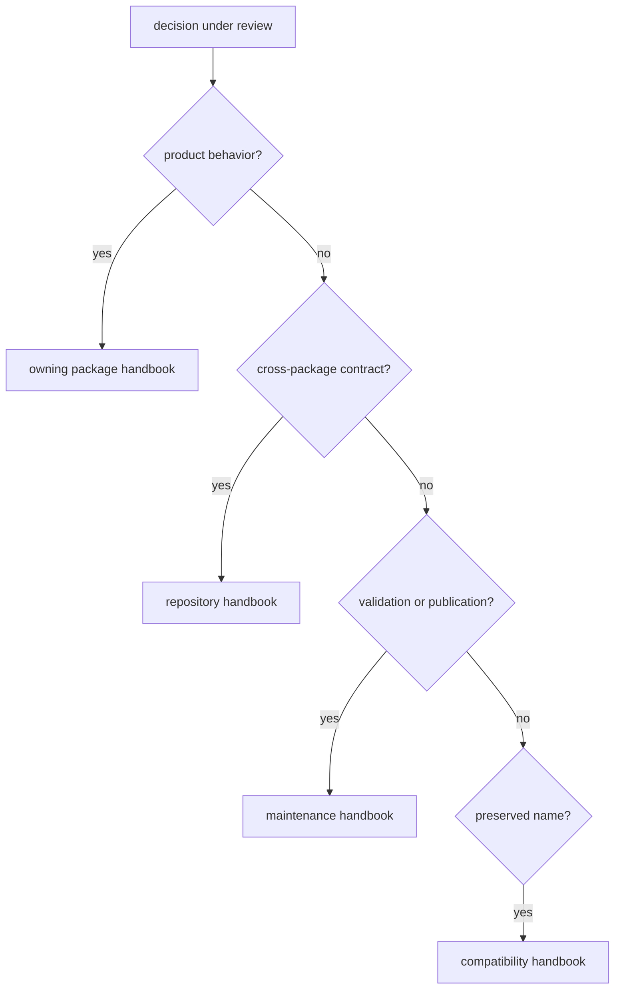
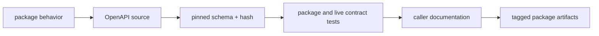

# Repository Handbook

The repository root coordinates one tagged release line across five canonical
product packages, six compatibility distributions, one internal maintainer
package, five versioned HTTP contracts, shared documentation, and common CI and
publication workflows. Product behavior remains inside the package that owns
it; the root owns the machinery that proves the pieces still agree.

<strong>The root is a coordination layer, not a shadow owner.</strong>
Product behavior belongs in the publishable packages under `packages/`. The
root owns only what is genuinely shared: workspace layout, schema governance,
documentation rules, validation posture, and release coordination.

## Repository Contract

| Root surface | Authority | Does not establish |
| --- | --- | --- |
| `pyproject.toml` and `uv.lock` | workspace membership, release package set, dependency resolution | package behavior |
| `apis/` | versioned HTTP schema source, pins, and hashes | implementation conformance by itself |
| `Makefile` and `makes/` | repeatable local command graph and package dispatch | CI success without execution |
| `.github/workflows/` | verification, policy, docs, and publication orchestration | local package semantics |
| `docs/` and `mkdocs.yml` | public information architecture and routing | executable proof |
| `packages/bijux-canon-dev` | repository-health checks and release guards | end-user runtime behavior |

```mermaid
flowchart LR
    source["tagged source"]
    canonical["5 canonical packages"]
    compat["6 compatibility packages"]
    schemas["5 API contracts"]
    checks["local + CI verification"]
    releases["PyPI + GHCR + GitHub release"]

    source --> canonical --> checks --> releases
    source --> compat --> checks
    source --> schemas --> checks
```

## Package Sets

- **canonical product:** runtime, agent, ingest, reason, and index
- **compatibility:** `bijux-canon`, `agentic-flows`, `bijux-agent`, `bijux-rag`,
  `bijux-rar`, and `bijux-vex`
- **internal support:** `bijux-canon-dev`, which is tested with the primary set
  but excluded from the public release package list

The root release configuration is the source of truth for these sets. A
directory under `packages/` is not automatically public, canonical, or eligible
for publication.

## Read From The Decision Outward

Start at the layer that made the decision, then move outward only when the
question crosses a repository boundary:

```mermaid
flowchart TD
    question["decision under review"]
    product{"product behavior?"}
    package["owning package handbook"]
    shared{"cross-package contract?"}
    root["repository handbook"]
    automation{"validation or publication?"}
    maintain["maintenance handbook"]
    continuity{"preserved name?"}
    compat["compatibility handbook"]

    question --> product
    product -->|yes| package
    product -->|no| shared
    shared -->|yes| root
    shared -->|no| automation
    automation -->|yes| maintain
    automation -->|no| continuity
    continuity -->|yes| compat
```

This routing prevents root-level configuration from being mistaken for product
semantics. For example, `pyproject.toml` can prove that a distribution is in the
release set; only the owning package can prove what an execution request means.

## Trace A Shared Contract

A public contract can cross the root without transferring product ownership.
An HTTP change, for example, begins with the package that owns behavior and
then moves through repository-governed representations and checks:

```mermaid
flowchart LR
    behavior[package behavior]
    schema[OpenAPI source]
    pin[pinned schema + hash]
    tests[package and live contract tests]
    docs[caller documentation]
    release[tagged package artifacts]

    behavior --> schema --> pin --> tests --> docs --> release
```

The schema records the caller contract; the implementation and live contract
tests establish availability. The pin and hash expose drift. Documentation
explains the supported operation. Tagged artifacts determine what users can
actually install. A green result at one point does not erase a mismatch at
another.

## Audit The Runtime Integration Seam

Release membership proves that runtime installs the four lower canonical
packages; it does not prove that runtime can call them. The executable seam is
owned by
`packages/bijux-canon-runtime/src/bijux_canon_runtime/runtime/execution/integration_loaders.py`.
It requests package-root callables named `retrieve`, `enforce_contract`,
`reason`, and `run`.

The current ingest, index, reason, and agent roots do not expose that complete
set, and the runtime suite does not execute those loaders against all four real
canonical roots. The legacy fallbacks resolve to compatibility aliases of the
same roots rather than independent adapters. Repository and release checks can
therefore pass while installed live composition remains unproven.

For an integration claim, require all of the following evidence:

1. an explicit typed adapter owned by the relevant boundary;
2. an installed environment containing the exact canonical package versions;
3. a test that resolves every runtime loader without monkeypatching package
   roots;
4. one governed live flow that records retrieval, reasoning, agent, and runtime
   identities; and
5. a negative case for missing, malformed, and semantically incompatible
   adapter output.

Until that evidence exists, use the left-to-right system diagram as an
ownership map and treat package-local execution and runtime plan mode as the
demonstrated surfaces.

## Resolve Cross-Surface Disagreement

Repository evidence is deliberately redundant enough to expose drift. When
two surfaces disagree, resolve the question at the authority that owns it:

| Disagreement | Governing authority | Required follow-through |
| --- | --- | --- |
| package metadata versus workspace inventory | root release configuration | correct membership or metadata, then rerun inventory and publication guards |
| OpenAPI source versus live route | owning product package | reconcile behavior and schema, then refresh the pin, hash, and contract evidence |
| package README versus exported names | owning package facade and supported modules | correct the reader contract or implementation and protect it with focused tests |
| compatibility bridge versus canonical behavior | canonical package | fix the canonical owner; the bridge must delegate without translation |
| local check versus workflow result | the helper and command actually invoked | compare inputs, environment, exit status, and retained artifact before changing orchestration |
| built artifact versus tagged source | release custody chain | refuse publication until source SHA, package matrix, and artifact identity agree |

The strongest supported statement is the intersection of the governing
sources, not the most optimistic one. Root automation can detect a mismatch,
but it cannot redefine product semantics to make the mismatch disappear.

## Root Evidence By Question

| Question | Authoritative root surface | Continue in |
| --- | --- | --- |
| Which packages participate in the workspace and release? | `pyproject.toml`, workspace metadata, release package guards | [package map](foundation/package-map.md) |
| Which HTTP representation is governed? | `apis/<package>/v1/schema.yaml`, pin, and hash | owning package interface handbook |
| Which local command composes validation? | `Makefile` and `makes/` | [maintainer Make handbook](../07-bijux-canon-maintain/makes/index.md) |
| Which event triggers CI or publication? | `.github/workflows/` | [workflow handbook](../07-bijux-canon-maintain/gh-workflows/index.md) |
| Which record supports a cross-package claim? | owned models, schemas, tests, and retained artifacts | [evidence map](foundation/evidence-map.md) |
| What does an older package name execute? | compatibility package metadata and alias tests | [compatibility catalog](../08-compat-packages/catalog/index.md) |

Product semantics remain in ingest, index, reason, agent, or runtime. Helper
implementation remains in the maintenance handbook. The root establishes how
those surfaces agree; it does not become a second source for their behavior.

## Shared Package Map

| Canonical package | Repository-level promise | Root-level proof to inspect |
| --- | --- | --- |
| `bijux-canon-ingest` | source material becomes deterministic preparation output before downstream use | package entry in `pyproject.toml`, handbook route in `mkdocs.yml`, package code under `packages/bijux-canon-ingest` |
| `bijux-canon-index` | retrieval executes through auditable contracts rather than hidden search behavior | API schema under `apis/bijux-canon-index`, package tests, handbook route |
| `bijux-canon-reason` | retrieved evidence becomes claims, checks, and reasoning artifacts | API schema under `apis/bijux-canon-reason`, package tests, handbook route |
| `bijux-canon-agent` | role-based orchestration emits traces instead of swallowing decisions | API schema under `apis/bijux-canon-agent`, package tests, handbook route |
| `bijux-canon-runtime` | the full run is accepted, rejected, persisted, or replayed under explicit policy | API schema under `apis/bijux-canon-runtime`, runtime regression tests, handbook route |

## Boundary Example

A schema pin under `apis/`, a workspace-level validation rule, or a handbook
routing rule belongs here because it protects more than one package at once. A
change to ingest chunking, runtime replay semantics, or reason-level claim
formation does not belong here, even if the root automation or docs also have
to move with it.

## Cross-Package Anchors

- `pyproject.toml` declares the workspace and package set
- `mkdocs.yml` defines the published handbook structure
- `Makefile`, `makes/`, and `.github/workflows/` carry root-level operations
- `packages/` carries the canonical product boundaries the root must not blur

## Cross-Package Change Rule

A change that alters a public request or response must update its owning schema,
pinned representation, hash, implementation tests, and package docs together.
A change that alters release membership must update root metadata and release
guards. A change that alters only one package's domain semantics remains in
that package even when shared verification runs afterward.

## Continue By Intent

| Intent | Next page |
| --- | --- |
| understand why the repository is split this way | [Foundation](foundation/index.md) |
| inspect package ownership, workspace layout, and documentation structure | [Foundation](foundation/index.md) |
| contribute, validate, release, or recover | [Operations](operations/index.md) |
| inspect automation implementation and CI fan-out | [Maintenance Handbook](../07-bijux-canon-maintain/index.md) |
| migrate a preserved distribution or import name | [Compatibility Packages](../08-compat-packages/index.md) |
