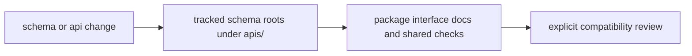

# API and Schema Governance

Shared API artifacts live under `apis/` so schema review does not depend on
reading package source alone.

This page exists to answer one operational question clearly: when is a schema
change just local code movement, and when is it a compatibility event that
needs shared review.

## Governance Flow

This page should make schema governance feel procedural rather than implicit.
A reader needs to see when a change crosses the line from local implementation
movement into shared compatibility review.

## Compatibility Threshold

Treat a change as a shared compatibility event when it changes any caller- or
reader-facing contract that is tracked outside one module alone, including:

- request or response shapes in tracked OpenAPI material
- pinned schema artifacts under `apis/`
- field names, required fields, or semantics that more than one package or
  external caller depends on
- workflow checks whose purpose is to prove schema alignment

## First Proof Checks

- `apis/` for the tracked schema roots and pinned artifacts
- the owning package interface docs for the public contract being changed
- drift or validation checks under `.github/workflows/` and maintainer tooling
  when the change claims to stay safe

## Shared Schema Roots

- `apis/bijux-canon-agent/v1`
- `apis/bijux-canon-index/v1`
- `apis/bijux-canon-ingest/v1`
- `apis/bijux-canon-reason/v1`
- `apis/bijux-canon-runtime/v1`

## Design Pressure

Schema drift becomes expensive when local code changes look harmless but alter
what another package, caller, or shared check will read. Governance has to make
that threshold obvious before review falls back to guesswork.
