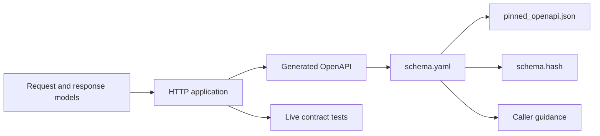
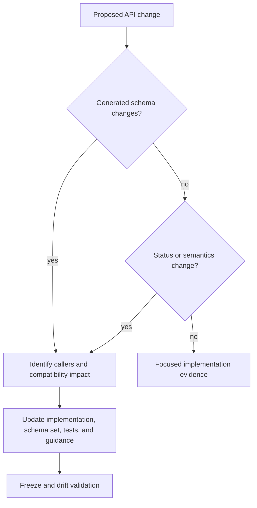

# API and Schema Governance

Bijux Canon governs five versioned HTTP contracts under `apis/`: ingest,
index, reason, agent, and runtime. Each contract has three checked-in
representations and an owning implementation. Agreement among those surfaces
is the basis for compatibility review.

```text
apis/<distribution>/v1/
├── schema.yaml
├── pinned_openapi.json
└── schema.hash
```

| File | Purpose |
| --- | --- |
| `schema.yaml` | reviewed OpenAPI source contract |
| `pinned_openapi.json` | canonicalized JSON representation used for freeze comparison |
| `schema.hash` | SHA-256 integrity value for the YAML contract |

The owning package supplies the application object, route behavior, and live
contract tests. A schema can describe an intentionally unavailable operation;
callers must still observe documented runtime behavior such as `501`.

## Contract Chain


```mermaid
flowchart LR
    model[Request and response models] --> app[HTTP application]
    app --> generated[Generated OpenAPI]
    generated --> yaml[schema.yaml]
    yaml --> pin[pinned_openapi.json]
    yaml --> digest[schema.hash]
    app --> live[Live contract tests]
    yaml --> docs[Caller guidance]
```

No single node proves the complete API:

- models without a route describe data, not availability;
- a route without checked-in schema can drift invisibly;
- a matching pin and digest prove internal schema consistency, not live
  behavior;
- documentation without schema and execution evidence is an unsupported
  promise.

## Change Classification

Treat a change as caller-visible when it alters any of these:

- path, method, status code, content type, or authentication requirement;
- required or optional fields, defaults, nullability, or enum values;
- field meaning, units, ordering, uniqueness, or identifier scope;
- pagination, limits, error envelopes, or retry semantics;
- operation availability, including movement between implemented and
  contract-only status;
- stable examples used as executable requests.

A serializer refactor is internal only when the generated contract and live
behavior remain equivalent. Renaming a Python helper can be private; renaming
a JSON field is a compatibility event even if both changes are mechanically
small.

## Compatibility Decisions


```mermaid
flowchart TD
    change[Proposed API change] --> generated{Generated schema changes?}
    generated -- no --> behavior{Status or semantics change?}
    generated -- yes --> consumers[Identify callers and compatibility impact]
    behavior -- no --> focused[Focused implementation evidence]
    behavior -- yes --> consumers
    consumers --> coordinated[Update implementation, schema set, tests, and guidance]
    coordinated --> freeze[Freeze and drift validation]
```

Additive changes are not automatically harmless. A new required response
field can break strict decoders; a new enum member can break exhaustive
switches; a new endpoint can expose authority the deployment is not prepared
to grant. Review the semantic contract, not only the OpenAPI diff category.

For breaking changes, choose an explicit strategy: preserve the old behavior,
introduce a versioned surface, or publish migration and retirement terms. Do
not make a pinned file match by hand while leaving the owning implementation
or callers behind.

## Validation Layers

| Validation | What it establishes | What it cannot establish |
| --- | --- | --- |
| OpenAPI lint | document structure and rule compliance | application behavior |
| freeze check | pin and hash match `schema.yaml` | live schema parity |
| drift check | generated application schema matches checked-in source | endpoint correctness |
| live contract test | requests and responses conform during execution | every deployment policy |
| package tests | domain and interface behavior | cross-package release consistency |

Repository freeze validation canonicalizes YAML and pinned JSON before
comparison and independently checks the digest. Package profiles generate
OpenAPI from their application object and write diagnostic output beneath
`artifacts/` when drift is found.

## Review Record

For a caller-visible API change, retain:

- owning distribution and versioned API directory;
- before-and-after OpenAPI diff;
- implementation route and typed model changes;
- freeze, drift, and focused live-contract results;
- status-code and error-envelope decisions;
- compatibility assessment and migration guidance;
- package version or release in which the change becomes available.

Generated schema output belongs under `artifacts/` unless it is deliberately
promoted into all three governed files. Never edit only
`pinned_openapi.json` or `schema.hash` to silence drift.

## Ownership Boundary

The root owns schema representation, freeze policy, and cross-package
consistency. The product package owns route semantics and availability. The
deployment owns network exposure, credentials, rate limits, and service-level
policy. Keeping those authorities separate prevents a checked-in OpenAPI file
from being mistaken for a production guarantee.

See [Testing and Validation](testing-and-validation.md) for evidence selection,
[Artifact Governance](artifact-governance.md) for generated-file handling, and
each package’s interface chapter for operation-specific behavior.
