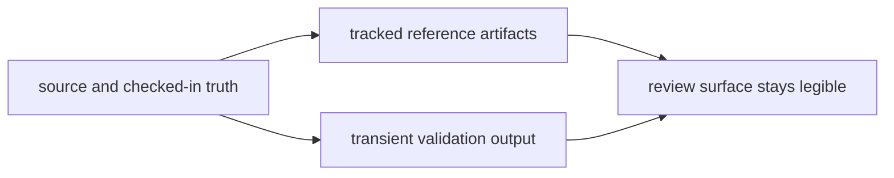

# Artifact Governance

Generated output is useful only when its status is obvious.

The repository needs a simple distinction between source, tracked reference
artifacts, and disposable validation output. Without that distinction,
reviewers waste time guessing whether a generated file is authoritative,
incidental, or stale.

## Artifact Flow

This page should help a reader classify an artifact before debating whether it
belongs in git. The key distinction is not generated versus handwritten, but
governed reference versus disposable run output.

## Artifact Classes

- tracked reference artifacts under `apis/` when schema review depends on them
- tracked release-facing or repository-facing evidence when a checked history
  is part of the review surface
- generated local or CI output under `artifacts/` when the output supports
  validation rather than source

## First Proof Checks

- `apis/` when the artifact is part of a public contract review
- `artifacts/` when the output exists only to prove or inspect a run
- package release files when the artifact is part of published package evidence

## Common Failure Mode

The easiest artifact mistake is letting transient output look canonical because
it sits near source or because a workflow generated it once. If review would not
compare historical versions of the file on purpose, it probably does not belong
in a tracked source surface.

## Design Pressure

Artifact clutter starts when transient output is allowed to look canonical just
because it was generated by an important workflow. Governance has to keep the
difference between review history and run residue obvious.
