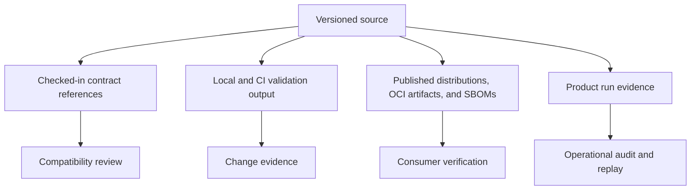
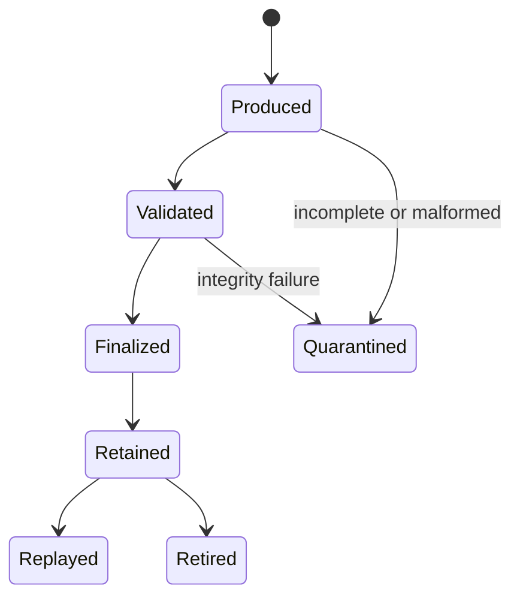

# Artifact Governance

Bijux Canon produces artifacts at four authority levels: checked-in contract
references, product run evidence, local validation output, and published
release assets. Their storage location, integrity model, and retention rules
are intentionally different.

```mermaid
flowchart TD
    source[Versioned source]
    contract[Checked-in contract references]
    run[Product run evidence]
    validation[Local and CI validation output]
    release[Published distributions, OCI artifacts, and SBOMs]

    source --> contract
    source --> validation
    source --> release
    source --> run
    contract --> review[Compatibility review]
    validation --> proof[Change evidence]
    run --> audit[Operational audit and replay]
    release --> consumers[Consumer verification]
```

## Artifact Classes

| Class | Examples | Authority and retention |
| --- | --- | --- |
| contract reference | OpenAPI YAML, pinned JSON, schema digest | checked in because historical review is part of the contract |
| product evidence | ingest observations, index artifacts, reason bundles, agent traces, runtime DuckDB records | retained according to the owning package’s audit and replay contract |
| validation output | rendered docs, test reports, generated schemas, caches, logs | generated beneath `artifacts/`; reproducible and normally not committed |
| release asset | wheel, sdist, OCI artifact, registry digest, CycloneDX SBOM | immutable after publication and bound to a resolved version |

Generated does not mean disposable, and checked in does not mean executable.
A runtime trace is generated but may be the strongest evidence of a decision.
A pinned schema is checked in but cannot prove that a route is deployed.

## Identity and Integrity

An artifact that supports a decision needs enough identity to prevent
substitution:

- producer package and version;
- artifact type and schema or contract version;
- stable run, request, tenant, or package identity where applicable;
- content digest over a defined serialization;
- parent or source references;
- configuration, policy, model, tool, or environment fingerprints needed to
  interpret it;
- creation and finalization state.

Package contracts determine the exact fields. Reason fingerprints canonical
trace bytes; runtime records causal events and finalization in DuckDB; index
artifacts retain request and backend provenance. A generic filename is never a
substitute for those identities.

## Lifecycle

```mermaid
stateDiagram-v2
    [*] --> Produced
    Produced --> Validated
    Validated --> Finalized
    Finalized --> Retained
    Retained --> Replayed
    Retained --> Retired
    Produced --> Quarantined: incomplete or malformed
    Validated --> Quarantined: integrity failure
```

Not every package uses these exact labels, but the distinctions remain
important. An incomplete run must not be presented as finalized. A valid
artifact can still be rejected by policy. A replayable artifact can reproduce
execution without proving the scientific truth of its inputs.

## Local Output Discipline

Repository checks write generated output beneath `artifacts/`, including
documentation sites, OpenAPI drift output, test caches, build distributions,
SBOMs, and logs. This provides a stable inspection location without mixing run
residue into source directories.

Promote generated output into a checked-in surface only when all of these are
true:

1. historical comparison is part of review;
2. the owning source and regeneration command are explicit;
3. integrity or drift validation exists;
4. consumers require the retained representation;
5. the change updates source and generated reference together.

OpenAPI pins satisfy this model. A rendered documentation site or pytest cache
does not.

## Product Evidence

Move and retain a product artifact as a complete authority set:

- Reason replay needs the specification, plan, run metadata, trace, and
  recorded results—not a detached `trace.jsonl` alone.
- Agent result and trace files are written separately and must remain paired
  under one output root.
- Runtime replay can depend on the DuckDB file, schema metadata, source
  manifest, policy, dataset descriptor, and external artifact payloads.
- Index persistence and comparison require backend capability and request
  identity as well as ranked results.

Copying only the visually interesting output often destroys the provenance
required to interpret it.

## Release Assets

Release artifacts are rebuilt from tagged source, checked for metadata and
version agreement, and published as immutable assets. Wheels and source
distributions pass Twine validation. Package SBOMs distinguish production and
development dependency sets. Release workflows can attach these outputs with
package-specific names.

Consumers should verify the registry or release identity and retain the SBOM
associated with the exact artifact. Rebuilding the same version later is not
equivalent to retrieving the originally published bytes.

## Security and Privacy

Artifacts can contain prompts, source excerpts, evidence, model responses,
tenant identifiers, filesystem paths, or provider details. Apply access
control, encryption, retention, and redaction according to content—not file
extension. Never include credentials or authorization headers in traces,
reports, tickets, or release assets.

When redaction changes bytes, preserve the original digest and access-controlled
artifact separately; label the redacted copy as a derivative rather than
claiming byte identity.

## Acceptance Questions

Before relying on an artifact, ask:

- Which package or workflow produced it?
- Is it complete, finalized, and valid under its own schema?
- Does its digest cover the bytes being inspected?
- What parent data, policy, and environment are required to interpret it?
- Is it authoritative evidence, a derived view, or disposable diagnostics?
- Can it be replayed or regenerated, and are those claims byte-exact or
  semantic?
- Which retention and access controls apply?

See [API and Schema Governance](api-and-schema-governance.md) for checked-in
contract artifacts, [Release and Versioning](release-and-versioning.md) for
publication, and the owning package’s artifact-contract page for exact fields.
