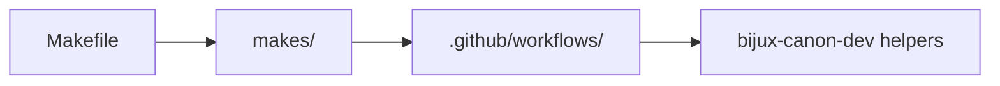

# Automation Surfaces

Repository automation should be visible in named surfaces, not hidden behind
tribal shortcuts.

## Automation Stack

This page should make shared automation traceable in one pass. A maintainer
needs to know where a command starts, where it delegates, and where shared code
begins without reverse-engineering shell glue.

## Automation Order

Read shared automation in this order:

1. `Makefile` for the top-level entrypoint a maintainer is expected to start from
2. `makes/` for the structured library behind shared commands
3. `.github/workflows/` for published verification, docs, and release execution
4. `packages/bijux-canon-dev` for code-bearing maintainer helpers

## Why The Order Matters

A top-level command is usually the fastest operational route. A workflow file is
usually the fastest route when the question starts from CI. `bijux-canon-dev`
should explain helper behavior, not hide the only honest owner of a repository
rule.

## Failure Signals

- a contributor cannot tell which root command is canonical for common work
- a workflow changes repository-wide behavior but the owning file is not easy to name
- a helper script starts carrying product logic that belongs in one package

## Design Pressure

Automation becomes opaque when helpers, workflows, and commands can no longer
be named in order. Once the execution path is guesswork, root tooling starts
hiding the very behavior it is supposed to make reviewable.
