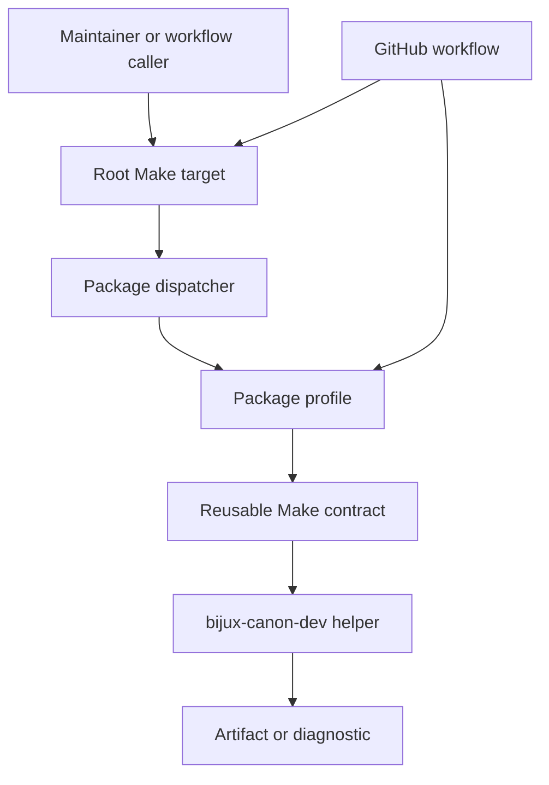

# Automation Surfaces

Repository automation has four distinct layers: a root command surface,
reusable Make contracts, Python helpers for rules that need structured logic,
and GitHub workflows that supply triggers and permissions. Following the
layers prevents CI behavior from becoming a second, undocumented implementation
of local checks.


```mermaid
flowchart TD
    U[Maintainer or workflow caller] --> M[Root Make target]
    M --> D[Package dispatcher]
    D --> P[Package profile]
    P --> C[Reusable Make contract]
    C --> H[bijux-canon-dev helper]
    H --> A[Artifact or diagnostic]
    W[GitHub workflow] --> M
    W --> P
```

## Layer responsibilities

| Layer | Owns | Does not own |
| --- | --- | --- |
| root `Makefile` and `makes/root.mk` | discoverable repository commands and orchestration groups | package-specific test semantics |
| `makes/bijux-py/` | reusable install, test, quality, security, API, build, docs, and SBOM contracts | package identity or domain behavior |
| `makes/packages/` | declarative package bindings, paths, extras, exclusions, and package-specific target composition | copied implementations of shared target families |
| `packages/bijux-canon-dev` | structured repository rules, comparison logic, and durable diagnostics | product runtime behavior |
| `.github/workflows/` | triggers, matrices, permissions, concurrency, artifact transfer, and publication | a hidden alternative to checked-in local commands |

## Root command flow

`make test PACKAGE=bijux-canon-reason` follows a concrete path:

1. the root dispatcher resolves the package or alias from `makes/packages.mk`;
2. it selects the profile under `makes/packages/`;
3. it supplies repository, configuration, API, and artifact paths;
4. the profile includes the reusable package contract;
5. the target provisions its environment and writes evidence beneath
   `artifacts/bijux-canon-reason/`; and
6. the dispatcher aggregates failures and returns a repository-level status.

The same dispatch family serves `test`, `lint`, `quality`, `security`, `api`,
`build`, and `sbom`. `PACKAGE=<slug>` narrows a target. Omitting it selects the
target's declared package group.

## Discover and inspect commands

```bash
make help
make list
make list-all
make -f "$PWD/makes/packages/bijux-canon-runtime.mk" \
  -C packages/bijux-canon-runtime help
```

Package directories have no standalone Makefiles. Supplying the profile path
is required for direct package inspection; normal execution should use the
root dispatcher.

## Environment and artifacts

Root documentation and shared-helper lanes use a check environment beneath
`artifacts/`. Package profiles use package environments and package-scoped
artifact roots. The dispatcher passes absolute paths so changing the invoked
working directory does not relocate schemas, configuration, or results.

Generated test reports, builds, schemas, logs, caches, SBOMs, and local run
products must remain beneath `artifacts/` or another governed output directory.
The dispatcher performs root-pollution cleanup after package work, but cleanup
is not a substitute for correct output routing.

## Workflow relationship

The verification workflow first checks policy prerequisites and repository
automation contracts, then calls the reusable package workflow across the
canonical product packages and `bijux-canon-dev`. Workflows may provide a
matrix, a Python version, credentials, or an artifact upload boundary. They
should call the same Make profiles and helper modules used locally.

Generated standards workflows are downstream copies of the shared standards
source. Their local presence documents execution but does not authorize
repository-specific edits to generated content.

## Failure interpretation

| Failure | First owner to inspect |
| --- | --- |
| unknown package or alias | `makes/packages.mk` catalog and resolver |
| missing package profile | `makes/packages/` mapping |
| environment cannot be created | root or package environment contract and lockfile |
| one package target fails | package profile, reusable target, and generated diagnostic |
| local command passes but workflow fails | workflow inputs, permissions, runner, matrix, or external service |
| workflow passes with unexpected artifact | staging and upload contract, not only job status |

Automation is reviewable when the caller, delegated target, rule owner,
environment, and resulting evidence can all be named without reverse-engineering
an opaque shell chain.
