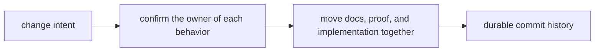

# Change Management

The repository should make change easier to reason about, not easier to hide.

## Change Loop

This page should frame change management as packaging explanation and proof
while the work is still moving. A change series is healthy when the ownership
story gets clearer as the edits accumulate.

## Fail-Fast Gates

A cross-package change is not ready to merge until it passes all of these tests:

- the owner of each changed behavior is still easy to name
- docs, proof, and implementation move in the same change series when they
  describe the same rule
- release-facing or compatibility effects are visible in the changed surfaces
- the commit boundaries explain durable intent instead of bundling unrelated work

## Most Common Failure Mode

The usual repository rework debt comes from changes that technically worked but
left the reason for the split harder to explain. The cost appears later as
cleanup, duplicated rules, or confused root ownership.

## First Proof Checks

- the changed handbook pages under `docs/`
- the package or root surface that implements the behavior
- the test, workflow, or schema check that proves the rule still holds

## Design Pressure

The repository pays later for changes that were easy to merge but hard to
describe. If the explanation loop stays open until after merge, the history is
already losing information.
