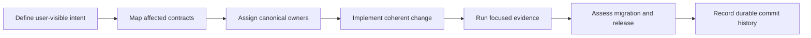
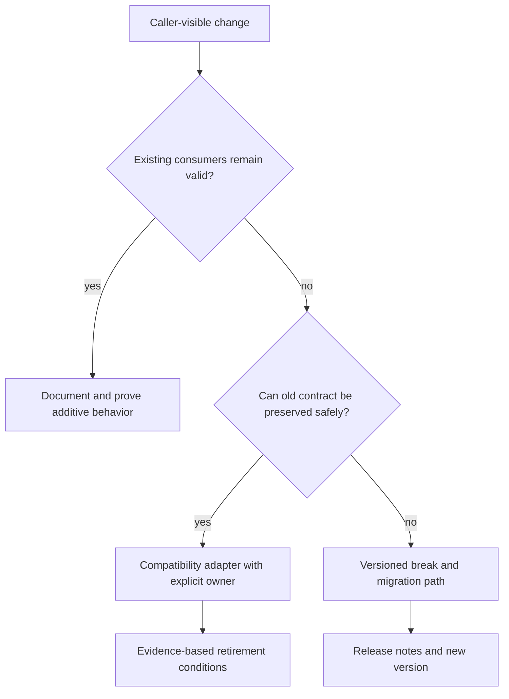

# Change Management

A Bijux Canon change is managed by the contracts it crosses. The durable unit
is a coherent decision: one owner, its implementation, its public and persisted
representations, and the evidence that shows they agree.

```mermaid
flowchart LR
    intent[Define user-visible intent] --> impact[Map affected contracts]
    impact --> owner[Assign canonical owners]
    owner --> implementation[Implement coherent change]
    implementation --> evidence[Run focused evidence]
    evidence --> compatibility[Assess migration and release]
    compatibility --> history[Record durable commit history]
```

## Build an Impact Map

Before editing, identify the surfaces the decision can change:

| Surface | Questions |
| --- | --- |
| Python | imports, call signatures, models, exceptions, defaults? |
| CLI | command names, flags, output, exit codes, paths? |
| HTTP | schema, route availability, status codes, authentication? |
| artifacts | fields, ordering, hashes, schema versions, retention? |
| persistence | migrations, finalization, resume, replay semantics? |
| compatibility | preserved distributions, imports, commands, translations? |
| operations | configuration, budgets, recovery, security, deployment? |
| release | dependency graph, build contents, version policy, SBOM? |

An impact map is evidence-based. Search the owning implementation, schemas,
tests, package metadata, examples, and published guidance. Do not infer safety
from a small diff.

## Choose the Canonical Owner

Product behavior begins in ingest, index, reason, agent, or runtime. Repository
metadata and `bijux-canon-dev` may validate the family, but they do not acquire
product ownership. Compatibility packages forward older names and contain only
the translation required by that contract.

When several packages consume an artifact, the producer still owns its meaning.
Consumers own admission and downstream decisions. For example, reason owns
support linkage; runtime owns whether that reasoning evidence satisfies an
execution policy.

## Shape the Commit Series

Each commit must leave the repository coherent for one durable intent. Useful
boundaries include:

- domain behavior plus the focused tests that prove it;
- a schema source, pin, hash, and drift evidence for one API decision;
- a persistence migration plus compatibility and recovery evidence;
- a compatibility forwarding contract plus its canonical dependency;
- public guidance plus the real command or artifact surface it explains.

Do not divide commits by edit chronology. Avoid one catch-all commit spanning
unrelated packages, and avoid isolated prose or generated-file commits that
temporarily claim a contract the implementation does not support.

## Compatibility Strategy

```mermaid
flowchart TD
    change[Caller-visible change] --> existing{Existing consumers remain valid?}
    existing -- yes --> additive[Document and prove additive behavior]
    existing -- no --> preserve{Can old contract be preserved safely?}
    preserve -- yes --> bridge[Compatibility adapter with explicit owner]
    preserve -- no --> version[Versioned break and migration path]
    bridge --> retire[Evidence-based retirement conditions]
    version --> release[Release notes and new version]
```

Compatibility decisions must state what is preserved, where translation
occurs, which canonical package owns behavior, and how failure is reported.
Deprecation without measurable retirement conditions becomes permanent
ambiguity; removal without migration evidence becomes surprise breakage.

## Validate in Expanding Rings

Run evidence in this order:

1. focused invariant or contract test at the owning package;
2. package workflow for the changed execution path;
3. schema, artifact, replay, or compatibility check for the affected seam;
4. strict documentation validation for public commands and guidance;
5. broader repository or release checks only when the change reaches those
   surfaces.

Stop and diagnose the first failed ring. Re-running a broader lane does not
make a local contract failure less real. Store generated logs, sites, schemas,
and reports beneath `artifacts/` for inspection.

## Migration and Persistence

Changes to serialized or persisted state require four explicit decisions:

- how existing data is recognized;
- whether it is upgraded, read compatibly, or rejected;
- how interruption and partial conversion are recovered;
- which version or fingerprint records the new contract.

Never rewrite finalized evidence in place to make it conform. Preserve the
original, create a governed derivative or new run, and retain the relationship
between them.

## Release Readiness

A change is ready for publication when:

- all affected package versions resolve consistently from the intended tag;
- built distributions contain the expected imports, commands, and metadata;
- schema, pin, digest, and live implementation agree where applicable;
- compatibility packages still forward to the intended canonical owner;
- SBOMs describe both production and development dependency sets;
- public guidance names real capability and exposes material limitations;
- rollback means a new source decision and version, not replacing published
  bytes.

## Incident Feedback

Operational incidents often expose a contract gap rather than a one-off defect.
Feed the earliest authoritative failure back into the owning layer:

- missing provenance becomes a producer artifact change;
- ambiguous rejection becomes a typed error or verification change;
- unsafe retry becomes an idempotency or checkpoint contract;
- replay ambiguity becomes additional identity or envelope evidence;
- confusing migration becomes a compatibility-package correction.

The result should make the next incident diagnosable from retained evidence,
not from private memory.

See [Change Principles](../foundation/change-principles.md) for invariants,
[Testing and Validation](testing-and-validation.md) for proof selection,
[API and Schema Governance](api-and-schema-governance.md) for HTTP changes, and
[Release and Versioning](release-and-versioning.md) for publication authority.
