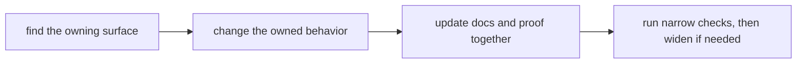

# Contributor Workflows

Contributors should be able to move through the repository in a repeatable
order.

## Workflow Loop

This page should show contribution as a routing problem first. The fastest
useful workflow is the one that reaches the honest owner early and widens only
when the work actually becomes shared.

## Default Workflow

1. identify the owning package or shared root surface first
2. change the owned behavior where it actually lives
3. update the explanation and proof that defend that behavior
4. run the narrowest relevant checks before widening the scope
5. use root automation only when the work genuinely crosses package boundaries

## Most Common Failure Mode

The most expensive contributor mistake is starting at the root because the root
is visible, then discovering late that the behavior was package-local all
along. That path creates blurred ownership and extra rework.

## Shared Contributor Anchors

- `CONTRIBUTING.md` for repository expectations
- `Makefile` and `makes/` for shared entrypoints
- `.github/workflows/` for repository verification and publication flow
- the handbook sections under `docs/` for durable operational memory

## Design Pressure

Contributor workflow breaks down when the root becomes the default starting
point for package-local work. That mistake creates extra validation, blurred
ownership, and avoidable rework.
