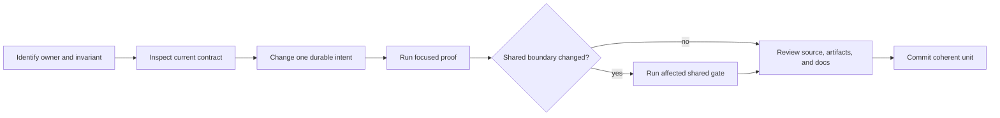

# Contributor Workflows

A contribution begins by locating the decision owner and ends with evidence
that matches the changed contract. The repository supports narrow package loops
without requiring every contributor to run the entire release pipeline.


```mermaid
flowchart LR
    O[Identify owner and invariant] --> S[Inspect current contract]
    S --> C[Change one durable intent]
    C --> F[Run focused proof]
    F --> B{Shared boundary changed?}
    B -- no --> R[Review source, artifacts, and docs]
    B -- yes --> W[Run affected shared gate]
    W --> R
    R --> K[Commit coherent unit]
```

## Prepare the workspace

```bash
make install
make help
make list-all
```

`make install` uses the committed `uv.lock` for the root development
environment. Package targets provision their own declared environments when
needed. Keep generated output beneath `artifacts/`.

## Choose the owning surface

| Change | Start in |
| --- | --- |
| ingest, index, reason, agent, or runtime behavior | owning canonical package |
| shared package inventory, navigation, or API placement | repository root |
| reusable gates or structured repository checks | `makes/` or `bijux-canon-dev` |
| workflow triggers, permissions, or publication transfer | owning workflow source |
| older public import, distribution, or command | compatibility package after canonical behavior exists |

Read the adjacent tests, schemas, artifact docs, and recent commits before
introducing a new pattern.

## Run narrow evidence

Use the root dispatcher for package targets:

```bash
make test PACKAGE=bijux-canon-index
make lint PACKAGE=bijux-canon-index
make quality PACKAGE=bijux-canon-index
```

For an individual test, use the package environment created by its profile:

```bash
packages/bijux-canon-index/.venv/bin/python -m pytest \
  packages/bijux-canon-index/tests/<area>/<test-file>.py -q
```

Documentation-only changes normally require `make docs-check`. Add API, build,
security, lock, or package gates only when their contract changed. `make check`,
`make all`, and `make test-all` are broad repository-confidence lanes, not
inner-loop commands.

## Keep representations aligned

A public change may have several owned representations:

- Python models, imports, and type markers;
- CLI registration, exit behavior, and structured output;
- handler behavior plus OpenAPI source, pinned output, and hash;
- serialized artifacts, fingerprints, manifests, migrations, and replay rules;
- README and handbook examples; and
- changelog and compatibility guidance.

Update only the representations that genuinely changed, but do not leave two
surfaces describing different meaning.

## Review generated evidence

Inspect artifacts rather than trusting command success alone. A schema drift
report, warning, rejected trace, empty build directory, skipped optional
backend, or non-certifiable result can make a green process status insufficient
for the claimed behavior.

Before committing:

1. inspect tracked and untracked changes;
2. confirm generated products are not scattered into source directories;
3. review the focused evidence and any affected public example;
4. stage only the coherent unit; and
5. use a scoped Conventional Commit subject that names the durable intent.

## Cross-boundary changes

When one change touches several owners, preserve their contracts separately.
For example, a new runtime requirement for agent evidence needs an agent-owned
trace change and a runtime-owned admission change, each with its own tests. The
root may coordinate the shared representation without becoming a third product
implementation.

The contribution is complete when a future reviewer can identify the owner,
reproduce the proof, interpret the generated artifacts, and understand any
compatibility or migration consequence from checked-in material alone.
