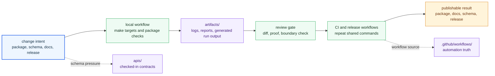

# Operations

The operations section covers the shared procedures that keep the package split
credible after code changes: local workflow, validation, schema review,
artifact handling, release flow, and review discipline.

The main mistake this section should prevent is operational folklore. Shared
work should be discoverable from checked-in commands, workflows, schemas, and
docs instead of from CI archaeology or private maintainer memory.

## Operating Loop

Operations pages should make the shared work loop visible: a contributor
changes a package or root contract, runs the relevant local command, leaves
artifacts in the repository-owned output area, and lets CI repeat the same
intent before release.

## Start Here

- open [Contributor Workflows](https://bijux.io/bijux-canon/01-bijux-canon/operations/contributor-workflows/) for the shortest route through normal repository work
- open [Testing and Validation](https://bijux.io/bijux-canon/01-bijux-canon/operations/testing-and-validation/) when you need to know which shared proof must run before acceptance
- open [API and Schema Governance](https://bijux.io/bijux-canon/01-bijux-canon/operations/api-and-schema-governance/) when the concern is contract drift or reviewed schema change
- open [Release and Versioning](https://bijux.io/bijux-canon/01-bijux-canon/operations/release-and-versioning/) when the concern is tag behavior, package publication, or release discipline
- open [Automation Surfaces](https://bijux.io/bijux-canon/01-bijux-canon/operations/automation-surfaces/) when you need to know which shared root automation owns the current action

## Pages In This Section

- [Local Development](https://bijux.io/bijux-canon/01-bijux-canon/operations/local-development/)
- [Testing and Validation](https://bijux.io/bijux-canon/01-bijux-canon/operations/testing-and-validation/)
- [Release and Versioning](https://bijux.io/bijux-canon/01-bijux-canon/operations/release-and-versioning/)
- [API and Schema Governance](https://bijux.io/bijux-canon/01-bijux-canon/operations/api-and-schema-governance/)
- [Contributor Workflows](https://bijux.io/bijux-canon/01-bijux-canon/operations/contributor-workflows/)
- [Automation Surfaces](https://bijux.io/bijux-canon/01-bijux-canon/operations/automation-surfaces/)
- [Artifact Governance](https://bijux.io/bijux-canon/01-bijux-canon/operations/artifact-governance/)
- [Review Expectations](https://bijux.io/bijux-canon/01-bijux-canon/operations/review-expectations/)
- [Change Management](https://bijux.io/bijux-canon/01-bijux-canon/operations/change-management/)

## Open This Section When

- you are performing repository-wide work instead of one package-local change
- you need the operational truth for shared automation, release, or validation
- you are checking whether a proposed workflow is explicit enough to maintain

## Open Another Section When

- the real question is still why the split exists or where authority changes hands
- you already know the issue belongs in one package's local operations docs
- you need maintainer-helper implementation detail rather than repository procedure

## First Proof Checks

- `Makefile` and `makes/` for shared command entrypoints and routing
- `.github/workflows/` for repository-wide automation and release execution
- `apis/` for schema governance surfaces that affect shared review
- the relevant package handbook once the action stops being truly shared

## Bottom Line

These pages should tell a maintainer what shared procedure to trust, what file
enforces it, and what proof should fail if it drifts. If the workflow still
depends on memory, the repository procedure is not documented strongly enough.
