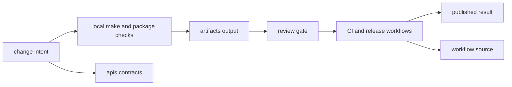

# Operations

The operations section covers the shared procedures that keep the package split
credible after code changes: local workflow, validation, schema review,
artifact handling, release flow, and review discipline.

The main mistake this section should prevent is operational folklore. Shared
work should be discoverable from checked-in commands, workflows, schemas, and
docs instead of from CI archaeology or private maintainer memory.

## Operating Loop

Operations pages should make the shared work loop visible: a contributor
changes a package or root contract, runs the relevant local command, leaves
artifacts in the repository-owned output area, and lets CI repeat the same
intent before release.

Repository operations should read like a closed loop, not like a bag of
commands. A maintainer starts from one explicit change, runs the checked-in
entrypoints, leaves machine output in `artifacts/`, and relies on review and
CI to replay the same intent. If a step cannot be traced to one of those
surfaces, it is operational folklore rather than repository procedure.

## Start Here

- open [Contributor Workflows](https://bijux.io/bijux-canon/01-bijux-canon/operations/contributor-workflows/) for the shortest route through normal repository work
- open [Testing and Validation](https://bijux.io/bijux-canon/01-bijux-canon/operations/testing-and-validation/) when you need to know which shared proof must run before acceptance
- open [API and Schema Governance](https://bijux.io/bijux-canon/01-bijux-canon/operations/api-and-schema-governance/) when the concern is contract drift or reviewed schema change
- open [Release and Versioning](https://bijux.io/bijux-canon/01-bijux-canon/operations/release-and-versioning/) when the concern is tag behavior, package publication, or release discipline
- open [Automation Surfaces](https://bijux.io/bijux-canon/01-bijux-canon/operations/automation-surfaces/) when you need to know which shared root automation owns the current action

## Pages In This Section

- [Local Development](https://bijux.io/bijux-canon/01-bijux-canon/operations/local-development/)
- [Testing and Validation](https://bijux.io/bijux-canon/01-bijux-canon/operations/testing-and-validation/)
- [Release and Versioning](https://bijux.io/bijux-canon/01-bijux-canon/operations/release-and-versioning/)
- [API and Schema Governance](https://bijux.io/bijux-canon/01-bijux-canon/operations/api-and-schema-governance/)
- [Contributor Workflows](https://bijux.io/bijux-canon/01-bijux-canon/operations/contributor-workflows/)
- [Automation Surfaces](https://bijux.io/bijux-canon/01-bijux-canon/operations/automation-surfaces/)
- [Artifact Governance](https://bijux.io/bijux-canon/01-bijux-canon/operations/artifact-governance/)
- [Review Expectations](https://bijux.io/bijux-canon/01-bijux-canon/operations/review-expectations/)
- [Change Management](https://bijux.io/bijux-canon/01-bijux-canon/operations/change-management/)

## First Proof Checks

- `Makefile` and `makes/` for shared command entrypoints and routing
- `.github/workflows/` for repository-wide automation and release execution
- `apis/` for schema governance surfaces that affect shared review
- the relevant package handbook once the action stops being truly shared

## Leave This Section When

- the work is already local to one package's own operations surface
- the real question is repository intent rather than repository procedure
- the next step is maintainer-helper implementation detail instead of the shared workflow contract
