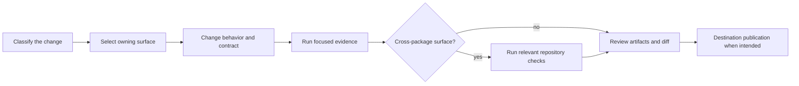
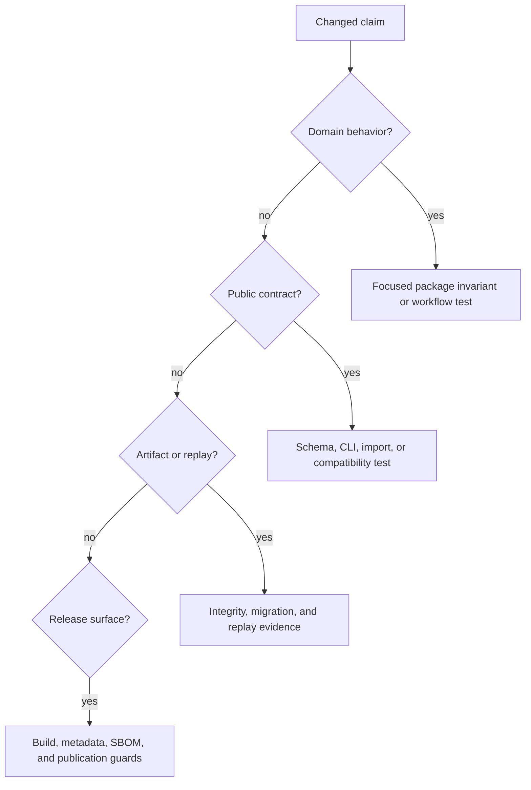

# Operations

Repository operations coordinate five canonical packages, six compatibility
distributions, shared HTTP contracts, documentation, and publication. The
default operating rule is simple: begin at the owner of the changed claim,
prove it locally, and widen validation only for boundaries that actually
changed.


```mermaid
flowchart LR
    classify[Classify the change] --> owner[Select owning surface]
    owner --> implement[Change behavior and contract]
    implement --> focused[Run focused evidence]
    focused --> shared{Cross-package surface?}
    shared -- no --> review[Review artifacts and diff]
    shared -- yes --> repository[Run relevant repository checks]
    repository --> review
    review --> release[Destination publication when intended]
```

## Route by Change

| Change | Primary owner | First operational route |
| --- | --- | --- |
| ingest, retrieval, reasoning, agent, or runtime behavior | canonical package | package operations and focused tests |
| shared OpenAPI representation | owning package plus root schema governance | [API and Schema Governance](api-and-schema-governance.md) |
| root package inventory or command dispatch | root metadata and `makes/` | [Automation Surfaces](automation-surfaces.md) |
| public handbook content or navigation | `docs/` and `mkdocs.yml` | [Testing and Validation](testing-and-validation.md) |
| older package, import, or command name | compatibility distribution | [Compatibility Handbook](../../08-compat-packages/index.md) |
| build, SBOM, release, or repository-health rule | `bijux-canon-dev` and workflows | [Maintenance Handbook](../../07-bijux-canon-maintain/index.md) |

Root operations do not replace package operations. A package owns its domain
invariants and local recovery. The root becomes relevant when the change
alters a shared representation, package family, site, or release decision.

## Local Entry Points

The root Makefile exposes the maintained command graph. Discover commands from
the current checkout:

```bash
make help
make list
make list-all
make -f "$PWD/makes/packages/bijux-canon-runtime.mk" \
  -C packages/bijux-canon-runtime help
```

`make list` shows the primary packages used by root product checks, including
`bijux-canon-dev`. `make list-all` also includes the six compatibility package
directories. A direct profile command must use an absolute `-f` path because
GNU Make changes directory before opening the requested Makefile.

Use narrow targets during development:

```bash
# Public site, navigation, and strict rendering
make docs-check

# One package's test surface
make test PACKAGE=bijux-canon-reason

# Shared OpenAPI freeze and package drift checks
make api

# Workspace lock consistency
make lock-check
```

`make check`, `make all`, and `make test-all` intentionally aggregate broad or
expensive work. They are release or repository-confidence routes, not the
default response to a local documentation or package change.

Package directories do not contain standalone Makefiles. Root targets dispatch
through profiles under `makes/packages/`; supply the profile explicitly only
when inspecting a package's target catalog.

## Package Selection

| Command | Selection | Environment | Failure result |
| --- | --- | --- | --- |
| `make test PACKAGE=bijux-canon-reason` | one canonical package | shared root check environment | package status |
| `make test PACKAGE=bijux-rar` | canonical reason package through compatibility alias | shared root check environment | canonical package status |
| `make test` | packages tagged `test` in the catalog | shared root check environment | aggregated failed-slug list |
| `make security PACKAGE=bijux-canon-agent` | one canonical package | package environment | package status |
| `make build PACKAGE=bijux-canon-index` | one buildable package | package environment | build status and retained artifacts |

Aliases are routing conveniences for the root dispatcher. To test the wrapper
distribution itself, select its catalog slug such as
`PACKAGE=compat-bijux-rar`. Dispatch continues across a selected group after a
failure and returns status `2` with the complete failed package list.

## Evidence by Boundary


```mermaid
flowchart TD
    claim[Changed claim]
    domain{Domain behavior?}
    public{Public contract?}
    persistent{Artifact or replay?}
    publication{Release surface?}

    claim --> domain
    domain -- yes --> package[Focused package invariant or workflow test]
    domain -- no --> public
    public -- yes --> contract[Schema, CLI, import, or compatibility test]
    public -- no --> persistent
    persistent -- yes --> replay[Integrity, migration, and replay evidence]
    persistent -- no --> publication
    publication -- yes --> release[Build, metadata, SBOM, and publication guards]
```

Generated evidence belongs beneath `artifacts/`. A rendered site proves that
Markdown and navigation build; it does not prove product behavior. A broad CI
lane cannot compensate for a missing assertion at the package that owns the
claim.

## Shared Contract Operations

Five OpenAPI directories each retain source YAML, canonical pinned JSON, and a
digest. An HTTP change needs implementation evidence and representation
evidence. Use freeze checks for agreement within the checked-in schema set and
drift checks for agreement with the application-generated schema.

Artifact changes require their own authority review. Product run evidence,
local validation output, and release assets have different finalization,
integrity, and retention rules. Follow [Artifact Governance](artifact-governance.md)
before copying or publishing a generated file.

## Review and Acceptance

Before a change is accepted, establish:

- the owner of every changed decision;
- the public and persisted representations affected;
- the narrow validation that proves the changed claim;
- any compatibility, migration, recovery, or replay consequence;
- the generated artifacts produced by validation and where they were stored;
- the release boundary, if the change is intended for publication.

Inspect both source changes and generated diagnostics. A successful command
with an unexpected schema diff, warning, veto, non-certifiable trace, or empty
artifact set is not successful evidence.

## Publication Boundary

Versions resolve from Git tags and flow into each independently installable
distribution. Publication builds and validates package artifacts before any
upload. Compatibility packages share the release line but preserve their own
metadata and forwarding contracts.

Publication is irreversible: never replace a released version with different
bytes. Correct a defect in source, create a new version, and retain the failed
release evidence. PyPI, GHCR, and GitHub Release are independent destination
workflows; record each result rather than inferring an atomic release from one
successful job. See [Release and Versioning](release-and-versioning.md) for the
exact ownership split.

## Operational Guides

| Need | Guide |
| --- | --- |
| prepare the uv workspace and use package-local loops | [Local Development](local-development.md) |
| choose focused versus repository-wide checks | [Testing and Validation](testing-and-validation.md) |
| understand root command delegation | [Automation Surfaces](automation-surfaces.md) |
| govern source, pins, hashes, and live HTTP behavior | [API and Schema Governance](api-and-schema-governance.md) |
| classify generated, retained, and published artifacts | [Artifact Governance](artifact-governance.md) |
| coordinate a cross-surface change | [Change Management](change-management.md) |
| review ownership, evidence, and compatibility | [Review Expectations](review-expectations.md) |
| build and publish versioned distributions | [Release and Versioning](release-and-versioning.md) |

For product-specific installation, configuration, diagnostics, and recovery,
continue in the owning package handbook. For helper implementation, CI fan-out,
SBOMs, and repository-health internals, continue in the maintenance handbook.
