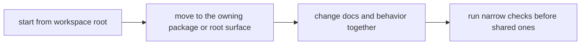

# Local Development

Local work should happen through the owning package plus the root commands that
keep cross-package work consistent.

## Local Loop

This page should make local development feel deliberate rather than wide. The
goal is not to run every command early; it is to prove the owned behavior first
and widen only when the change genuinely crosses surfaces.

## Shortest Trustworthy Loop

1. start from the workspace root so package and root tooling stay visible
2. move into the owning package or shared root surface
3. change docs with code when the behavior description also changed
4. run the narrowest relevant checks before widening to shared validation
5. inspect the exact files that enforce the claim you are about to make

## First Proof Checks

- `pyproject.toml` for workspace metadata and shared tooling rules
- `Makefile` and `makes/` for common local workflows
- the owning package tests before broader root validation
- `.github/workflows/` only when the local question depends on shared CI or release behavior

## Common Failure Mode

The usual local-development mistake is running broad root commands too early and
never confirming the owning package behavior first. That slows feedback and can
hide whether the real problem is local or shared.

## Design Pressure

Local development gets noisy when broad root commands become a substitute for
understanding the owner. Once that happens, feedback slows down and the real
scope of the change becomes harder to see.
