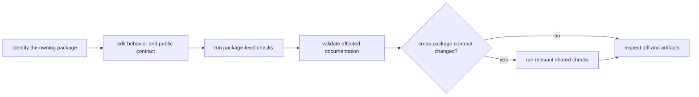

# Local Development

Bijux Canon is a uv workspace with package-specific commands behind a shared
root Makefile. The fastest reliable development loop starts at the owning
package, writes generated output under `artifacts/`, and widens validation only
when a change crosses package boundaries.

## Prepare the Workspace

The repository requires Python 3.11 or newer and uses the committed `uv.lock`
for a reproducible development environment.

```bash
git clone https://github.com/bijux/bijux-canon.git
cd bijux-canon
make install
make list-all
```

`make install` syncs the root development group from `pyproject.toml` and
`uv.lock`. The group includes the canonical packages, compatibility packages,
and documentation toolchain. `make list-all` prints the package slugs accepted
by the root command dispatcher.

Use `make help` to see the current root targets rather than relying on a copied
command list.

## Work at the Owning Boundary


```mermaid
flowchart LR
    locate["identify the owning package"]
    change["edit behavior and public contract"]
    narrow["run package-level checks"]
    docs["validate affected documentation"]
    wider{"cross-package contract changed?"}
    shared["run relevant shared checks"]
    review["inspect diff and artifacts"]

    locate --> change --> narrow --> docs --> wider
    wider -- no --> review
    wider -- yes --> shared --> review
```

Package source, tests, metadata, and local Make targets live together under
`packages/<package-name>/`. Root targets dispatch to packages declared in
`makes/packages.mk`; the aliases there also show which compatibility
distribution corresponds to each canonical package.

Examples of narrow feedback loops:

```bash
# Validate the public documentation site.
make docs-check

# Inspect package-specific commands.
make -C packages/bijux-canon-ingest help

# Run the owning package's default test surface.
make -C packages/bijux-canon-ingest test
```

Avoid `make check`, `make all`, and `make test-all` as inner-loop commands.
They intentionally aggregate repository-wide work. Use them when the change
actually requires repository-wide confidence, not as a substitute for locating
the affected contract.

## Keep Generated Output Contained

Repository tooling places documentation builds, test reports, package builds,
SBOMs, and other generated products under `artifacts/`. Application examples
should also use an explicit path beneath that directory.

```bash
mkdir -p artifacts/local-example
```

Do not treat generated run directories as source files. A clean source diff
should contain only intentional code, documentation, configuration, or governed
generated assets.

## Validate the Claim You Changed

| Change | First validation |
| --- | --- |
| one package's Python behavior | its focused test or package `test` target |
| public Markdown or navigation | `make docs-check` |
| dependency metadata | `make lock-check` after the lock is intentionally refreshed |
| package build metadata | the package build and `twine` check |
| API schema or generated contract | the owning API target and drift check |
| shared Make or config layout | `make check-make-layout` or `make check-config-layout` |

If a public behavior changes, update the owning handbook page in the same
change. Documentation examples are part of the interface: commands should use
real entry points, paths should match actual artifact layouts, and limitations
should remain visible.

## Before Committing

1. Inspect `git status --short` and both staged and unstaged diffs.
2. Confirm that generated output is under `artifacts/` and not staged.
3. Run the narrowest check that proves the changed contract.
4. Verify documentation when commands, APIs, storage, or compatibility changed.
5. Keep the commit scoped to one durable intent.

The [release and versioning guide](release-and-versioning.md) covers the
additional evidence required before a package is published.
