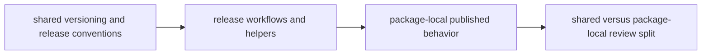

# Release and Versioning

Release behavior in `bijux-canon` is partly shared and partly package-local.
The repository owns the conventions that make the package family legible; the
packages own their published behavior.

## Release Model

This page should make the split visible between family-wide release governance
and package-specific publication facts. Readers should know when to stay at the
root and when to hand the question back to one package.

## Shared Release Rules

- root commit rules live in `pyproject.toml`
- package versions are written to package-local `_version.py` files by Hatch VCS
- release support helpers live in `bijux-canon-dev`
- split release workflows publish package artifacts and release metadata

## Compatibility Triggers

Treat a release change as shared governance when it changes:

- commit semantics that affect version discovery or release notes
- shared release workflows or publication routing
- metadata or tagging rules that apply across more than one package
- compatibility expectations around package naming or public release surfaces

## First Proof Checks

- `pyproject.toml` for commit and versioning conventions
- `.github/workflows/release-*.yml` for publication behavior
- the affected package handbook when the question narrows to one package release surface

## Design Pressure

Release logic gets muddy when shared governance and package-local publication
behavior are discussed as one thing. The boundary has to stay sharp enough that
release review does not turn into general repository folklore.
