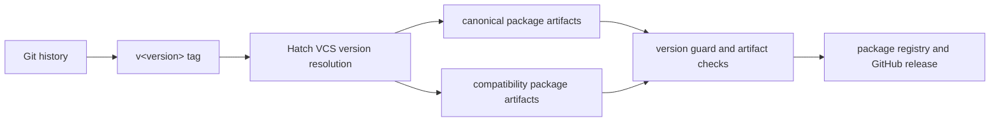
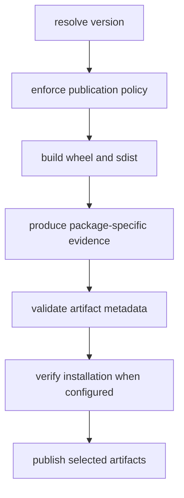

# Release and Versioning

Bijux Canon publishes a family of independently installable distributions from
one Git history. Versions come from repository tags, while package metadata and
release verification remain package-specific. This preserves a coherent
release line without pretending every package has the same public surface.

## Version Source

The root and package builds use Hatch VCS. A tag matching `v<version>` supplies
the release version; an untagged checkout receives an SCM-derived development
version. Commitizen uses the same `v$version` tag format and treats the project
as a pre-1.0 release line.


```mermaid
flowchart LR
    history["Git history"] --> tag["v&lt;version&gt; tag"]
    tag --> resolver["Hatch VCS version resolution"]
    resolver --> canonical["canonical package artifacts"]
    resolver --> compat["compatibility package artifacts"]
    canonical --> verify["version guard and artifact checks"]
    compat --> verify
    verify --> registries["package registry and GitHub release"]
```

Builds from a dirty or untagged checkout are useful for local verification but
are not interchangeable with a clean tagged release. The publication guard
rejects prerelease and local-version identifiers unless the release invocation
explicitly allows them.

## Published Set

The repository classifies distributions in `pyproject.toml`:

- five canonical runtime packages: ingest, index, reason, agent, and runtime;
- six compatibility packages preserving the `bijux-canon`, `agentic-flows`,
  `bijux-agent`, `bijux-rag`, `bijux-rar`, and `bijux-vex` surfaces;
- `bijux-canon-dev`, an internal support package used by repository tooling.

Compatibility distributions share the release line but retain their own wheel
metadata and import or command contract. Their purpose is continuity, not a
second implementation.

The runtime wheel also requires agent, ingest, reason, and index at exactly the
runtime version. Publication follows the dependency tiers declared by the root
package catalog: canonical leaf packages first; runtime and leaf aliases next;
and the two runtime aliases last. Exact pins deliberately turn a partial or
mixed family into a resolver conflict instead of an untested installation.

Before creating a release tag, build the complete family with the proposed
stable version and run the installed release-candidate identity check. The
check requires an absent, valid tag name targeting the clean evaluated commit;
matching source fallbacks and changelog entries; a current lock; and one
hash-bound wheel at that version for every repository distribution. It records
that no tag was created. Tag creation and publication remain separate,
explicitly authorized actions.

## Release Evidence

The common publication path resolves the version, applies publication policy,
builds wheel and source artifacts, and validates them with Twine before upload.
Package profiles may add stronger checks. For example, the index package emits
release metadata and SHA-256 sums, while the runtime package verifies that its
changelog contains the required sections for the resolved base version.


```mermaid
flowchart TD
    version["resolve version"] --> guard["enforce publication policy"]
    guard --> build["build wheel and sdist"]
    build --> metadata["produce package-specific evidence"]
    metadata --> twine["validate artifact metadata"]
    twine --> install["verify installation when configured"]
    install --> publish["publish selected artifacts"]
```

Useful local commands are deliberately non-uploading until publication is
explicitly requested:

```bash
# Build the repository's primary package artifacts.
make build

# Build and validate one package through its package Makefile.
make -C packages/bijux-canon-runtime release-dry

# Confirm documentation still represents the release surface.
make docs-check
```

Run `make help` and the owning package's `make help` for the exact targets
supported by the current checkout. Package profiles differ, so a command valid
for one distribution is not automatically a family-wide guarantee.

## Compatibility Review

A release needs explicit compatibility review when it changes any of these:

- import paths or names exported by a canonical package;
- console-script names, module entry points, flags, or exit behavior;
- serialized artifacts, database schemas, or replay records;
- configuration keys, environment variables, or default paths;
- the mapping from a compatibility distribution to its canonical owner.

For such changes, read the owning package's compatibility page and the relevant
section of the [compatibility handbook](../../08-compat-packages/index.md).
Version equality alone does not prove behavioral compatibility.

## Release Boundaries

Root configuration owns version discovery, the package catalog, and common
publication policy. Package metadata owns dependencies, entry points, build
contents, and package-specific verification. GitHub workflows own registry and
release orchestration. Keeping these layers distinct makes it possible to
answer three separate questions: what version is being built, what a package
contains, and where verified artifacts are published.
