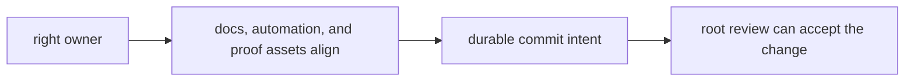

# Review Expectations

Repository review should be sharper at the root than it is in purely local
code.

## Review Model

This page should make root review feel stricter for concrete reasons, not
cultural ones. The repository needs a sharper review model because root mistakes
spread farther than package-local ones.

## Root Review Gates

Before accepting a root-facing change, confirm that:

- the chosen repository surface is still the right owner
- docs, automation, and proof assets move together when they describe one rule
- the change does not smuggle product behavior into maintainer or root layers
- the commit intent is durable enough to understand years later without private memory

## Evidence To Check First

- the relevant handbook page under `docs/`
- the root or package automation file that implements the behavior
- the test, workflow, or schema surface that proves the rule still holds

## Red Flags

- the explanation is spread across multiple places but none clearly own it
- the change is easy to apply but hard to describe at the repository boundary
- review confidence depends on memory instead of checked-in proof

## Design Pressure

Root review weakens as soon as familiarity substitutes for checked proof. If
the owner, evidence, or intent still has to be explained from memory, the
change is not yet reviewable enough.
