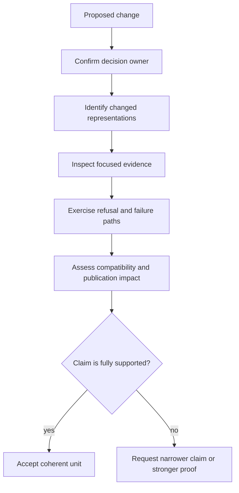

# Review Expectations

Repository review establishes ownership, contract consistency, evidence, and
failure honesty. A large green check set cannot compensate for a change placed
at the wrong boundary or a public claim unsupported by the retained artifacts.

```mermaid
flowchart TD
    C[Proposed change] --> O[Confirm decision owner]
    O --> R[Identify changed representations]
    R --> E[Inspect focused evidence]
    E --> F[Exercise refusal and failure paths]
    F --> P[Assess compatibility and publication impact]
    P --> A{Claim is fully supported?}
    A -- yes --> Y[Accept coherent unit]
    A -- no --> N[Request narrower claim or stronger proof]
```

## Review by surface

| Surface | Review questions | Evidence |
| --- | --- | --- |
| product package | Is the changed invariant owned here? Are adjacent packages left semantically intact? | focused domain, artifact, and failure tests |
| root contract | Does the rule truly span packages? Does it coordinate without interpreting product data? | inventory, navigation, layout, dispatch, or shared-schema checks |
| maintenance helper | Is structured code preferable to shell? Can the rule be traced from helper to test to caller? | helper tests, Make invocation, diagnostic artifact |
| workflow | Are trigger, permissions, concurrency, matrix, and artifact custody explicit? | workflow source plus called local command and upload/download contract |
| compatibility package | Does it delegate without independent semantics? | import, command, metadata, and parity tests |
| documentation | Are commands real, guarantees bounded, limits visible, and links routed to owners? | strict build, navigation tests, executable examples where practical |

## Contract consistency

Review every representation changed by the intent:

- model and serialized form;
- Python, CLI, and HTTP surfaces;
- checked-in schema source, pin, and hash;
- stored artifact, migration, and replay compatibility;
- package metadata, changelog, and compatibility route; and
- public explanation and example.

Parity means equivalent semantics, not identical transport syntax. If two
interfaces intentionally differ, the difference and ownership must be explicit.

## Failure honesty

Require negative evidence for high-trust boundaries. Invalid input, unsupported
capability, missing support, provider failure, policy rejection, migration
error, and replay mismatch must remain distinguishable from an empty or
successful result.

Review warnings and skipped tests. A skipped optional-backend test is not
backend conformance. A finalized trace is not automatic acceptance. A pinned
OpenAPI file is not evidence that every route is implemented.

## Scope and commit integrity

Each commit should carry one durable intent and leave the repository coherent.
Generated output and unrelated user work must not be staged. Names should
describe ownership or responsibility rather than delivery order or temporary
planning context.

Root and maintenance changes deserve particular scrutiny because a small edit
can fan out across every package. Confirm the exact package set and affected
command group instead of assuming repository-wide impact.

## Verification reporting

A review handoff states:

- exact commands that passed;
- checks intentionally not run and why;
- artifacts or diagnostics inspected;
- external systems not exercised;
- known limitations and compatibility consequences; and
- final branch and worktree state.

Do not describe an expensive lane as required when a narrower check proves the
change. Conversely, do not call a change complete when the relevant high-risk
contract was skipped merely because broad unrelated tests passed.

Review is complete when the accepted claim is no broader than its evidence and
the next maintainer can reconstruct the decision without private context.
