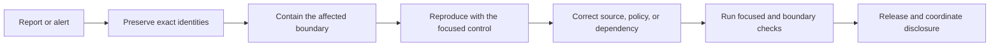

# Security Evidence and Incident Response

This runbook connects Bijux Canon's production threat model to the executable
controls that can confirm, contain, and retest a security failure. The durable
authority is the tracked implementation, focused tests, lock files, and this
response procedure. Generated logs and reports belong under `artifacts/`; they
are useful incident evidence, but deleting them must not delete the control or
the knowledge needed to reproduce it.



## Durable Security Evidence

Use the narrowest row that matches the suspected boundary. Run products should
record the full Git SHA, command, exit code, Python and tool versions, governing
lock digests, input identities, and retained failure output.

| Threat boundary | Durable control and executable evidence | First focused check |
| --- | --- | --- |
| retrieved-content prompt injection | agent policy, tool allowlisting, output schema, citation checks, and `test_untrusted_retrieved_content.py` | `python -m pytest -q packages/bijux-canon-agent/tests/integration/test_untrusted_retrieved_content.py` |
| path traversal, symlink escape, archive bombs | ingest file admission and archive extraction tests in `test_directory_source.py` and `test_file_admission.py` | `python -m pytest -q packages/bijux-canon-ingest/tests/unit/infra/adapters/test_directory_source.py packages/bijux-canon-ingest/tests/unit/infra/adapters/test_file_admission.py` |
| malformed or oversized parser input | bounded parser adapters and deterministic fuzz cases in `test_parser_admission_security.py` | `python -m pytest -q packages/bijux-canon-ingest/tests/unit/infra/adapters/test_parser_admission_security.py` |
| secret disclosure or provider misuse | secret-provider, transport, timeout, persistence, and redaction checks in `test_secret_provider_security.py` | `python -m pytest -q packages/bijux-canon-runtime/tests/unit/application/test_secret_provider_security.py` |
| artifact, index, or database tampering | publication transactions and index activation verify candidates before activation and preserve the last known-good generation | `python -m pytest -q packages/bijux-canon-runtime/tests/unit/runtime/test_publication_transactions.py packages/bijux-canon-index/tests/unit/application/test_index_activation.py` |
| resource exhaustion or concurrent state races | bounded durable-job admission, request/result limits, idempotency, and worker budgets in `test_durable_jobs.py` | `python -m pytest -q packages/bijux-canon-runtime/tests/unit/runtime/test_durable_jobs.py` |
| vulnerable dependencies or suppressed findings | fatal Bandit and pip-audit policy plus suppression-contract tests in `bijux-canon-dev` | `python -m pytest -q packages/bijux-canon-dev/tests/test_pip_audit_gate.py packages/bijux-canon-dev/tests/test_root_tooling_contract.py` |
| release substitution | `bijux-canon-supply-chain` binds every wheel or OCI archive to CycloneDX, source and lock identities, and an in-toto/SLSA statement | `python -m pytest -q packages/bijux-canon-dev/tests/test_supply_chain.py` |

Passing one row proves only that row's current contract. It does not prove that
an external provider, registry, host, or deployment is uncompromised. When an
incident crosses package boundaries, run every affected row and the relevant
package integration checks.

## Triage Procedure

1. Record the reporter, UTC detection time, affected package and version,
   deployment or registry identity, exact source commit, and observed impact.
2. Preserve the original input, logs, database or generation identity, release
   digest, SBOM, attestation, and configuration needed to reproduce the event.
   Store sensitive evidence in the approved incident system, not in Git.
3. Contain before investigating destructively. Revoke exposed credentials,
   disable the affected provider or tool, quarantine untrusted inputs or release
   assets, and keep the last verified generation active where the product
   supports transactional activation.
4. Reproduce from a clean checkout or the exact installed distribution. Start
   with the focused check above. Do not weaken a threshold, add a suppression,
   deselect a case, or overwrite the original evidence to obtain a green run.
5. Determine the earliest violated boundary: admission, parsing, retrieval,
   reasoning, tool authorization, persistence, activation, dependency
   resolution, build, or publication. Expand testing only across boundaries
   the evidence actually implicates.
6. Correct the durable owner—product code, package test, lock, or release
   control—and add a regression that fails on the retained minimal reproducer.
7. Re-run the focused negative and positive cases, then the owning package's
   integration boundary. For a published artifact, build a new version; never
   replace previously published bytes.
8. Record containment, root cause, affected versions and data, verification,
   recovery, notification, and follow-up owners before closing the incident.

## Symptom Routing

| Symptom | Contain first | Verify before recovery |
| --- | --- | --- |
| retrieved text changes tool or provider behavior | disable the affected tool/provider path and preserve the retrieved bytes | policy trace shows the content remained data; scope, schema, citation, and budget checks pass |
| parser hangs, expands, or consumes excessive memory | quarantine the source and stop automatic retries | the minimal source is refused within declared byte, page, structure, and time budgets |
| credential appears in logs or persisted evidence | revoke and rotate the credential; restrict evidence access | seeded canary is absent from exceptions, traces, configuration output, and persisted bundles |
| active artifact or database no longer matches identity | make the candidate unavailable and retain the active known-good generation | recomputation rejects the candidate and the prior generation remains readable |
| queue saturation or duplicate execution | stop new admission without deleting durable job state | configured caps fail closed and one idempotency key produces one attempt |
| dependency advisory or static-analysis finding | stop release of the affected resolution | strict audit passes with no blanket ignore or skip flags |
| wheel, image, SBOM, or provenance mismatch | quarantine every asset in the same publication batch | each artifact digest, SBOM, source, locks, builder, and attestation subject verify together |

## Supply-Chain Evidence

For release candidates, invoke the installed maintenance command against a
clean tree and a directory containing the complete wheel set:

```bash
bijux-canon-supply-chain \
  --repo-root "$PWD" \
  --wheel-dir artifacts/release/dist \
  --output-dir artifacts/release/supply-chain \
  --manifest artifacts/release/supply-chain.json \
  --lock uv.lock \
  --lock pyproject.toml
```

The command refuses a dirty source tree, missing locks, unsafe wheel members,
invalid or empty CycloneDX documents, duplicate artifact identities, digest
drift, and incomplete OCI coverage when a container build definition exists.
The generated in-toto/SLSA statements are unsigned local attestations. A
publication system may add a trusted signature, but must verify the same
subject and predicate bytes before attaching it.

## Known Limitations

- Fuzz and adversarial suites cover declared formats and policies; they do not
  prove safety for every possible byte sequence or future parser version.
- Dependency results are time-bound to the resolved environment and advisory
  database available during the run. Re-audit before release and after material
  advisory changes.
- Local attestations bind identities but do not establish a trusted remote
  builder or signature. Registry transparency, key custody, and deployment
  admission remain external controls.
- The current repository retains no OCI container build definition. Adding one
  creates an OCI evidence obligation; it must not be treated as an empty or
  automatically satisfied matrix row.
- Provider retention, network isolation, operating-system hardening, backups,
  tenant separation, and production monitoring are deployment responsibilities.
- Ordinary `artifacts/` content is disposable. Incident evidence that has legal
  or operational retention requirements must be moved to an approved durable
  incident store with access control and integrity records.

## Disclosure and Closure

Follow the private channels and response targets in the repository
[Security Policy](https://github.com/bijux/bijux-canon/blob/main/SECURITY.md).
Do not publish exploit details before
affected users have a reasonable remediation path. A closure record should
state affected and unaffected versions, severity rationale, compromise scope,
credential and data actions, corrective commits, exact verification commands,
release identities, disclosure decision, and remaining risk.

The [Production Threat Model](threat-model.md) defines boundaries and deployment
duties. [Artifact Governance](artifact-governance.md) explains which generated
records need retention. [Security Gates](../../07-bijux-canon-maintain/bijux-canon-dev/security-gates.md)
and [SBOM and Supply Chain](../../07-bijux-canon-maintain/bijux-canon-dev/sbom-and-supply-chain.md)
describe the repository-owned maintenance controls.
