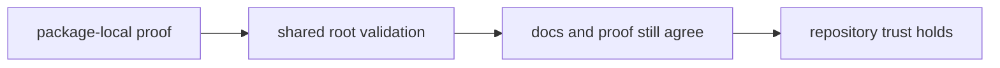

# Testing and Validation

Validation in `bijux-canon` is layered: packages protect their own behavior,
while the repository protects the seams between packages, schemas, docs, and
release conventions.

## Validation Ladder

This page should make validation order explicit. Trust starts where behavior is
owned and only widens to the repository when shared seams are genuinely in
play.

## Validation Order

1. run package-local proof first when the behavior is owned by one package
2. run shared root checks when the change reaches schemas, docs, workflows, or
   release governance
3. confirm that the documentation claim and the executable proof still match

## Shared Validation Surfaces

- package-local unit, integration, e2e, and invariant suites
- schema drift and packaging checks in `bijux-canon-dev`
- repository CI workflows under `.github/workflows/`

## Most Important Failure

The highest-cost validation mistake is letting a shared prose promise survive
without a test, workflow, or schema check that can notice drift. At that point
the repository is asking readers to trust style instead of proof.

## First Proof Checks

- the owning package tests when the change is still local
- `.github/workflows/` and maintainer tooling when the rule crosses packages
- `apis/` when the claim is about tracked contract alignment

## Design Pressure

Validation turns theatrical when broad checks run without a clear owned claim
underneath them. The ladder works only when local proof stays ahead of global
assurance.
