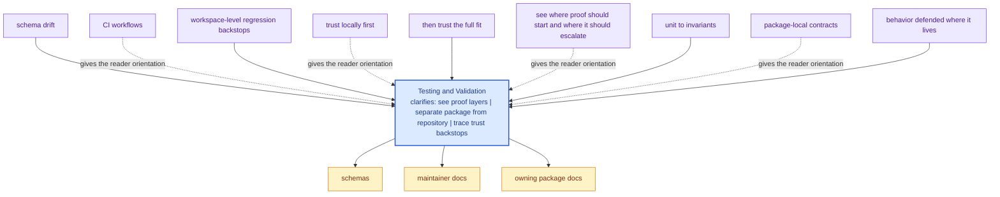

# Testing and Validation

Validation in `bijux-canon` is layered: packages protect their own behavior,
while the repository protects the seams between packages, schemas, docs, and
release conventions.

This distinction is essential for credibility. The repository should never ask
readers to trust prose alone. If a rule matters, some checked-in package test,
drift check, or CI workflow should be able to notice when it stops being true.

The deeper reason for this layout is that trust has to be local before it can
be global. Each package proves its own promises first. The repository then
proves that the packages still fit together honestly.

These repository pages should explain the cross-package frame that no single package can explain alone. They are strongest when they make the monorepo easier to understand without turning the root into a second owner of package behavior.

## Visual Summary

## Validation Layers

- package-local unit, integration, e2e, and invariant suites
- schema drift and packaging checks in `bijux-canon-dev`
- repository CI workflows under `.github/workflows/`

## Validation Rule

A prose promise is incomplete until either package tests or repository tooling
can detect its drift.

## Concrete Anchors

- `pyproject.toml` for workspace metadata and commit conventions
- `Makefile` and `makes/` for root automation
- `apis/` and `.github/workflows/` for schema and validation review

## Use This Page When

- you are dealing with repository-wide seams rather than one package alone
- you need shared workflow, schema, or governance context before changing code
- you want the monorepo view that sits above the package handbooks

## Decision Rule

Use `Testing and Validation` to decide whether the current question is genuinely repository-wide or whether it belongs back in one package handbook. If the answer depends mostly on one package's local behavior, this page should redirect instead of absorbing detail that the package should own.

## What This Page Answers

- which repository-level decision this page clarifies
- which shared assets or workflows a reviewer should inspect
- how the repository boundary differs from package-local ownership

## Reviewer Lens

- compare the page claims with the real root files, workflows, or schema assets
- check that repository guidance still stops where package ownership begins
- confirm that any repository rule described here is still enforceable in code or automation

## Honesty Boundary

These pages explain repository-level intent and shared rules, but they do not override package-local ownership. They also do not count as proof by themselves; the real backstops are the referenced files, workflows, schemas, and checks.

## Next Checks

- move to the owning package docs when the question stops being repository-wide
- check root files, schemas, or workflows named here before trusting prose alone
- use maintainer docs next if the root issue is really about automation or drift tooling

## Purpose

This page explains the relationship between package truth and repository truth.

## Stability

Keep it aligned with the current test layout and CI workflows instead of aspirational future checks.
