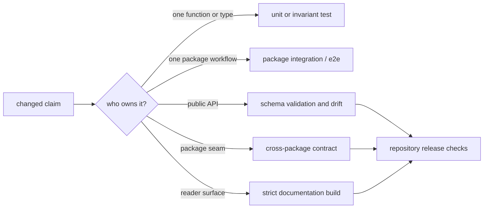

# Testing and Validation

Validation in `bijux-canon` starts with the smallest executable claim and
widens only when a change crosses a contract boundary. This keeps failures
attributable: a domain invariant is proved by its owning package, while frozen
schemas, documentation navigation, package inventory, and publication
metadata are proved at repository scope.

```mermaid
flowchart LR
    claim["changed claim"] --> owner{"who owns it?"}
    owner -->|one function or type| unit["unit or invariant test"]
    owner -->|one package workflow| integration["package integration / e2e"]
    owner -->|public API| api["schema validation and drift"]
    owner -->|package seam| contract["cross-package contract"]
    owner -->|reader surface| docs["strict documentation build"]
    api --> release["repository release checks"]
    contract --> release
    docs --> release
```

## Proof by claim

| Claim changed | Primary evidence | Broader evidence when required |
| --- | --- | --- |
| pure transformation, state transition, or invariant | focused unit/property test in the owning package | package test suite |
| pipeline, backend, replay, or persistence behavior | package integration or end-to-end test | dependent package contract test |
| request or response shape | checked-in OpenAPI schema and API tests | schema drift and freeze checks |
| command behavior | focused CLI test | package installation and entry-point checks |
| public documentation content or navigation | strict MkDocs build and documentation contract tests | publication URL checks |
| package inventory or dependency metadata | repository workspace tests | build and publication metadata checks |
| compatibility behavior | compatibility package contract tests | canonical-owner tests when behavior also changed |

Passing a broad repository lane does not replace a missing local assertion. If
the claim is “a finalized trace cannot be mutated,” the durable proof is a
runtime test that attempts the mutation and observes rejection. A successful
documentation build proves that the page renders and links resolve; it does
not prove the runtime invariant described by the page.

## Package-local validation

Each canonical package keeps its tests beside its implementation and exposes a
package profile under `makes/packages/`. The package test trees distinguish
unit, contract, integration, API/CLI, replay, and end-to-end evidence according
to the package's behavior. The quality chapter in each package handbook maps
its public guarantees to those suites:

- [ingest test strategy](../../02-bijux-canon-ingest/quality/test-strategy.md)
- [index test strategy](../../03-bijux-canon-index/quality/test-strategy.md)
- [reason test strategy](../../04-bijux-canon-reason/quality/test-strategy.md)
- [agent test strategy](../../05-bijux-canon-agent/quality/test-strategy.md)
- [runtime test strategy](../../06-bijux-canon-runtime/quality/test-strategy.md)

Run package-local checks when behavior is contained by one package. Escalate
to a consumer only when the producer's externally visible contract changed.

## Repository validation

Repository-owned tests in `bijux-canon-dev` protect seams that no product
package owns alone:

- workspace layout and package-profile alignment
- checked-in API schemas, schema hashes, and live-schema drift
- root configuration and coverage contracts
- documentation metadata, navigation, links, and publication URLs
- release history, package metadata, and publication artifacts
- compatibility-to-canonical package mappings

Root make targets dispatch into declared package profiles. The package catalog
rejects missing package directories, missing profiles, and undeclared package
directories before dispatch, preventing the test matrix from silently omitting
a package.

## Interpreting failures

| Failure | Investigate first |
| --- | --- |
| invariant or property assertion | owning domain type and transformation |
| replay fingerprint mismatch | source artifact, plan/configuration, entropy record, then serializer |
| OpenAPI drift | live application model and checked-in schema |
| package inventory mismatch | root workspace metadata and `makes/packages.mk` |
| documentation link/navigation failure | authored Markdown path and MkDocs navigation |
| compatibility regression | shim boundary first, canonical implementation only if canonical behavior also fails |

Validation artifacts belong under the repository `artifacts/` tree. Keeping
logs, generated schemas, rendered sites, and test reports there prevents proof
runs from changing source trees or appearing as publishable content.

## Evidence discipline

A trustworthy change records four facts: the claim that changed, its owning
boundary, the focused check that proves it, and any broader check intentionally
required by the affected seam. Expensive unrelated lanes add elapsed time but
do not make an unowned claim more credible.
